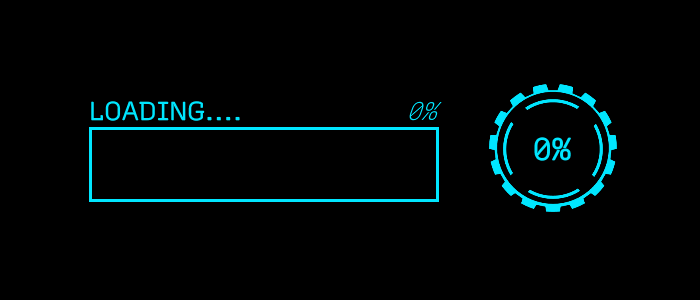

> ## View the entire tutorial on [GameDev Resources](https://gamedev-resources.com/ui-toolkit/32/).
# Introduction

A lot goes into creating an intuitive experience for your player. Progress bars are often used to reassure the player that something is happening (such as the game loading) or give them an idea on how long something will take. In this tutorial, you will learn some techniques for creating and animating progress bars using UI Toolkit and DOTween.

## Learning Outcomes
UI Toolkit does not have the ability to do masking, nor does it hook directly into the Animation system. You will learn techniques for working around these two limitations. At the end of the tutorial, you will be able to:

1.	Design UIs by using the UI Builder tool.
2.	Add a runtime UI to your game.
3.	Animate the UI through DOTween
4.	Hook up DOTween animations to trigger at specific points of a “regular” animation.

## Prerequisites

1.	You need [Unity 2020.3.0f1 (LTS)](https://unity3d.com/get-unity/download) or later to follow along with this tutorial.
2.	This tutorial assumes you already have basic knowledge of Unity and intermediate knowledge of C#.

> Tutorials may work with earlier versions. The version referenced is the on I used.

## Resources

1. [Unity Manual: UI Toolkit](https://docs.unity3d.com/2020.1/Documentation/Manual/UIElements.html)
2. [Unity Manual: UI Event System](https://docs.unity3d.com/2020.1/Documentation/Manual/UIE-Events.html)
3. [Unity Manual: UI Builder](https://docs.unity3d.com/Packages/com.unity.ui.builder@1.0/manual/index.html)
4. [DOTween Documentation](http://dotween.demigiant.com/documentation.php)

