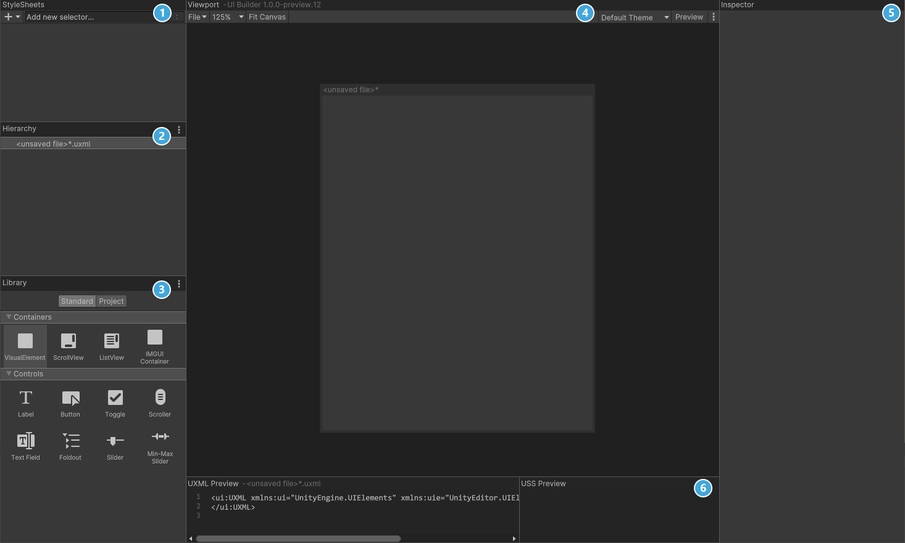

# Design the inventory UI
UI Builder is a way to visually create and edit UXML and USS files. It is also highly useful if you are creating your assets via code and want to mockup how something might look or to see what the proper syntax is for a style variable. Open the window by going to **Window** > **UI Toolkit** > **UI Builder**.

UI Builder is broken out into six different sections:

1. **StyleSheets**: Manage the stylesheets and individual selectors that are used in this document. Style Sheets can be shared across multiple documents, thereby maximising reusability.
1. **Hierarchy**: A list of all elements that are within the document. 
1. **Library**: Contains a list of standard elements that can be instantiated. The **Standard** tab contains UI Documents from Unity. The **Project** tab contains UI Documents created in your project.
1. **Viewport**: Visual of the UI document. 
1. **Inspector**: Contains modifiable attributes and style properties for the element currently selected in the hierarchy or StyleSheet sections.
1. **Code Preview**: Displays the UXML and USS code that UI Builder is generating based on your decisions. 

Now it’s time to create the Inventory UI. Inside UI Builder, click on the first item in the **Hierarchy window**, called **<unsaved window>.uxml**. This pulls up the base properties. Check the **Match Game View** checkbox. This ensures that the UI scales with the screen.

Next, Drag VisualElement from the library and drop it in the Hierarchy window. Click on it to pull up the properties. Set the following:
1. **Name**: Container
2. **Flex** > **Grow** is **1**.
3. **Align** > **Align Items**: center
4. **Align** > **Justify Content**: center

Drag another **VisualElement** into the hierarchy window and make it a **child of the Container**. Set the following properties:

1. **Name**: Inventory
2. **Flex** > **Grow** is **1**
2. **Size** > **Width & Height**: 50% and 75%
2. **Size** > **Max** > **Width & Height**: 50% and 75%
2. **Margin & Padding** > **Padding**: 10px
2. **Background** > **Color**: #1C2024
2. **Border** > **Color** > Top: #FFC500
2. **Border** > **Width** > Top: 5

Add a **Label** control as a **child of Inventory**. Set the following properties:

1. **Name**: Header
1. **Text**: Inventory
1. **Text** > **Size**: 24
1. **Text** > **Color**: #FFC500
1. **Margin & Padding** > **Margin** > **Bottom** >: 10px
1. **Border** > **Color** > **Bottom**: #404A52
1. **Border** > **Width** > **Bottom**: 1

Add a **VisualElement** control as a **child of Inventory**. Set the following properties:

1. **Name**: SlotContainer
1. **Flex** > **Grow** is **1**.
1. **Flex** > **Direction**: Row
1. **Flex** > **Wrap**: Wrap
1. **Align** > **Justify Content**:  center

**Save** your UXML document by going to **File** > **Save As** at the top of the **Viewport** section and name it **Inventory**. You should now have a window that looks like this:

> The layout engine that UI Toolkit uses is the open source project called  [Yoga](https://github.com/facebook/yoga), which implements a subset of Flexbox. Flexbox is an HTML/CSS based layout system. A useful guide to Flexbox can be found [here](https://css-tricks.com/snippets/css/a-guide-to-flexbox/).

## Create the stylesheet
As you can see, there are a lot of different properties that can be set for the elements. By setting them directly in the inspector like you did, you created what is called “Inline Styles”. This means that the styles are written directly to the UXML file, rather than being saved in the USS file. This is not great from both a maintenance and reusability standpoint. Fortunately, extracting the styles is easy to do. 

Create a USS file to store the styles:

1. In the **Stylesheet** section, click the **+** sign and select **Create new USS**. **Name** it **Inventory**. 

Next, you will generate a class for each element that you created. Here’s how to do it for **Container**: 

1. Click on the **Container** element. On the Inspector panel there is a section called **StyleSheet**, which has a sub-section called **Style Class List**. 
1. In the Style Class List is a text box, this is where you will enter the name of the class you want to generate. In this case, call it **container**.
1. Click on the **Extract Inlined Styles to New Class** button.

> If you want to reuse any of the styles that you have saved you can simply drag and drop them onto the element in the Viewport. Alternatively, type the name of an existing style in the **Style Class List text box** and click on **Add Style Class to List**.

You should see the new **“container” class** appear under the **Inventory.uss** file in the **StyleSheets section**. **Repeat** this process for each of the elements, using the name of the element for the class. Once done, save your UI by going to **File** > **Save**..

## A quick look at some important styles

Most of the styles are relatively self explanatory or their impact can be discovered easily by tweaking some properties. Here’s a few of the main ones that you’ll work with:

> You can read more about style properties in the UI Builder manual, [here](https://docs.unity3d.com/Packages/com.unity.ui.builder@1.0/manual/uib-styling-ui-positioning.html)

### Display and visibility
Display and visibility style properties are two ways that you can toggle whether the player can see the element. They have one major difference:

1. **Visibility**: The layout engine and [event system](https://docs.unity3d.com/2020.1/Documentation/Manual/UIE-Events.html) will still process an element that has their visibility set to hidden.
2. **Display**: The layout engine and event system will ignored the element if set to **display: none**.

Consider a scenario where you have a button that gets click events. If you want to hide the button but keep the click events coming through, you’d set the style to visibility:hidden. If you wanted to hide the button and prevent the events from going through, you’d set the style to display:none.

### Flex-basis, Flex-grow and flex-shrink
Flex basis, grow and shrink are probably the three most commonly used properties as they essentially define how the elements will or will not scale relative to each other. Here’s a quick explanation of each:

1. **flex-basis**: The default size of an element before the remaining space is distributed. Auto means “look at my height and width values”. 
2. **flex-grow**: Defines whether the item can grow if necessary. It’s a ratio shared with all siblings.
3. **flex-shrink**: Defines whether the item should shrink if necessary.

Consider a scenario where you wanted to have the inventory UI next to the equipment UI. Instead of sharing the screen space 50/50, you want the Inventory UI to be bigger. To achieve this, you could set Inventory’s flex-grow higher than the Equipment flex-grow, like so:

### Absolute and relative positioning
By default, all newly added elements have their positioning set to relative. This enables them to be processed by the Layout engine, and thus brings a lot of value around ease of maintenance. In fact, it’s generally discouraged to use the Absolute position mode unless necessary. 

Elements with a position of absolute are essentially ‘invisible’ to the layout engine. This means that properties like flex basis, flex-shrink, and flex-grow are irrelevant. Instead, you must set the width/height and **Position** > **Left**, **Top**, **Right** and **Bottom** properties directly. 

> In this project we will set just one element’s position to absolute - the “ghost” icon that moves with the mouse when you’re dragging an inventory item. The rest will be left at **relative** position.

### [Previous (Getting Started)](./pt1.md)    |     [Next (Add the Inventory UI to the game)](./pt3.md)

