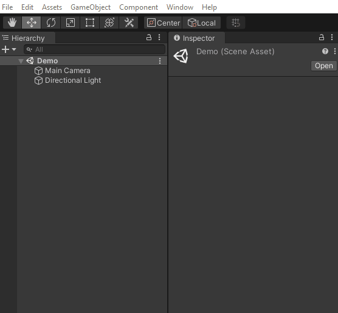
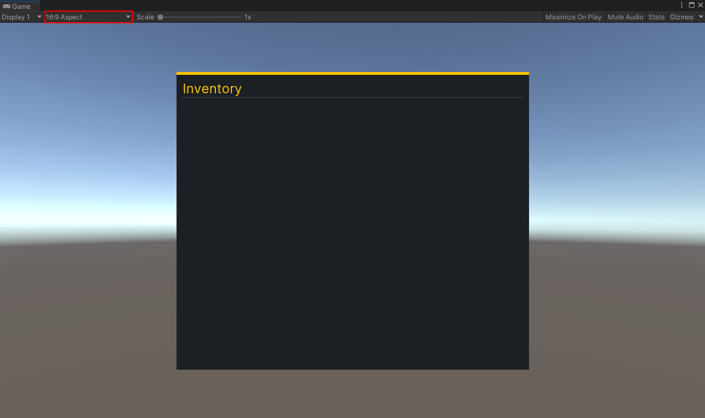

# Add the Inventory UI to the game
It’s time to add the screen to your scene! UI Toolkit comes with a UI Document component, which is where you specify two major areas:

1. **Panel Settings**: The panel is the root VisualElement that all UI Documents are attached to. It’s what handles drawing the UI in the Scene at runtime. There are several settings that you can set to define how the UI should appear at runtime.
2. **UI Document Component**:  Reference to UXML files that should be associated with the panel (root VIsualElement). You can have multiple of these. 

You must also have a UI Toolkit Event System component. The Event System component is what handles the input and sends the events to all active panels. Without it, your input will not be routed. There are two you can choose from, depending on if you are using the old or new Input System.

## Setup the Scene
You can add a UI Document GameObject to your scene to have Unity generate the necessary components and PanelSettings asset for you. Here’s how you can quickly set up the scene:

1. Add the UI Document GameObject by going to **GameObject** > **UI Toolkit** > **UI Document**. 
2. Name it **UserInterface**. 
3. Set the **Source Asset** to the **Inventory UXML** file that you saved earlier. 

Set your Game window aspect ratio to 16:9 and push play to see your inventory added to your screen.

> I’ve noticed a discrepancy in pixels when the aspect ratio is **Free Aspect** or **16:10**, so I have been sticking to **16:9** for now. 

> Go [here](https://docs.google.com/document/d/1C_c5hrqOrkgYjmD3s04vcKfk-aQ8n007Ti7vUR51SeQ/edit) for official documentation on setting up your Runtime UI. It has useful information about the display order of multiple UI Documents and how to set route the new Input System events.

### [Previous (Design the inventory UI)](./pt2.md)    |     [Next (Add the Inventory UI to the game)](./pt4.md)

