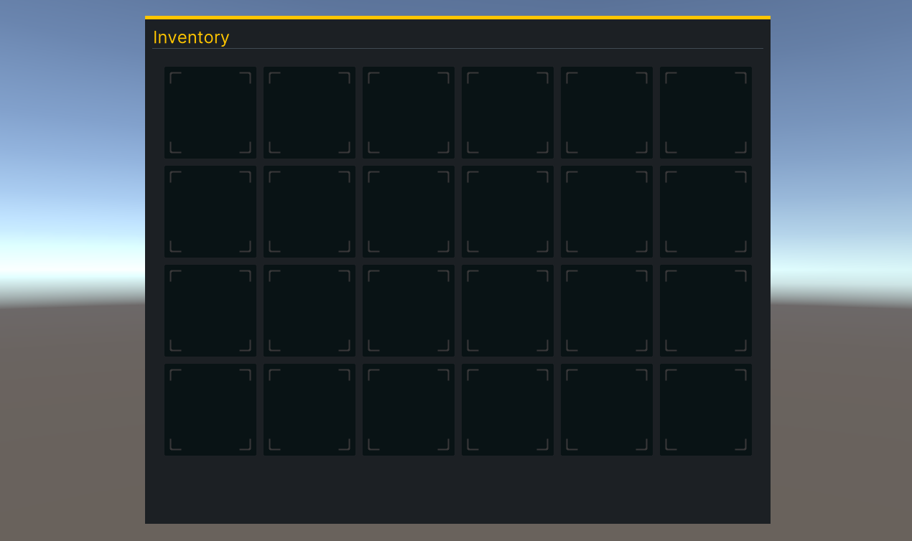

# Code the Inventory Slots
I’ve found that UI Builder isn’t always the right approach for creating my VisualElements. Most of the time I end up building the assets via C# code to keep things clean. For the InventorySlot, let’s skip the UI Builder and instead create them via C#. 

> You can also code the UXML file directly. You can read more about that method [here](https://docs.unity3d.com/Manual/UIE-WritingUXMLTemplate.html).

InventorySlot will consist of two elements for it’s hierarchy - the root (which is a VisualElement) and a child that is an Image. The image will only have a sprite if the slot has an item. Here’s what it’ll look like: 


Create a new script called **InventorySlot**. Have it **inherit** from **VisualElement** and add the following code:

```csharp
public class InventorySlot : VisualElement
{
    public Image Icon;
    public string ItemGuid = "";

    public InventorySlot()
    {
        //Create a new Image element and add it to the root
        Icon = new Image();
        Add(Icon);

        //Add USS style properties to the elements
        Icon.AddToClassList("itemIcon");
        AddToClassList("itemButton");
    }
}
```

When the `InventorySlot` is first instantiated, it’ll create a new **Image** element and add it as a **child** to the **root**. Next, it adds two new styles - `slotContainer` and `slotIcon`. These styles do not exist though, so now would be a good time to add them. Open the `Inventory.uss` stylesheet and add the following classes to the end:

```css
.slotContainer {
    width: 128px;
    height: 128px;
    margin: 5px;
    border-left-color: rgb(48, 48, 48);
    border-right-color: rgb(48, 48, 48);
    border-top-color: rgb(48, 48, 48);
    border-bottom-color: rgb(48, 48, 48);
    background-color: rgb(9, 19, 21);
    background-image: url('/Assets/WUG/Sprites/ItemSlotBackground.png');
    border-top-left-radius: 3px;
    border-bottom-left-radius: 3px;
    border-top-right-radius: 3px;
    border-bottom-right-radius: 3px;
}

.slotIcon {
    padding: 15px;
    flex-shrink: 0;
    flex-grow: 1;
}
```

1. `.slotContainer` will be a 128x128 square with **ItemSlotBackground.png** set to the `background-image`. Setting the `border-radius` to **3px** will give it slightly rounded corners. Finally, `margin` will add some space between all of the `InventorySlots`.
1. `.slotIcon` uses `flex-grow` to ensure that it fills up all available space but then applies a `padding` of **4px** to make sure it’s slightly smaller than the parent.

You need to have each slot instantiated before you can see InventorySlot in action. Create another class called `InventoryUIController`. Have it inherit from `MonoBehaviour` and add the following code:

```csharp
public List<InventorySlot> InventoryItems = new List<InventorySlot>();

private VisualElement m_Root;
private VisualElement m_SlotContainer;

private void Awake()
{
    //Store the root from the UI Document component
    m_Root = GetComponent<UIDocument>().rootVisualElement;

    //Search the root for the SlotContainer Visual Element
    m_SlotContainer = m_Root.Q<VisualElement>("SlotContainer");

    //Create InventorySlots and add them as children to the SlotContainer
    for (int i = 0; i < 20; i++)
    {
        InventorySlot item = new InventorySlot();

        InventoryItems.Add(item);

        m_SlotContainer.Add(item);
    }
}

```

Every **UI Document** component has a **root Visual Element**, which is stored in `m_Root` for easy access later. You can use either `Q` or `Query` to search for a specific element within the hierarchy. Providing either the type or the name is optional. In other words, these two lines accomplish the same thing for the Inventory UI:


```csharp
//Option 1:
m_SlotContainer = m_Root.Q<VisualElement>("SlotContainer");

//Option 2:
m_SlotContainer = m_Root.Query("SlotContainer");
```

> You can return the first result of the query by appending `.First()` at the end and the last by appending `.Last()`. For example: `m_SlotContainer = m_Root.Query("SlotContainer").First();`

Add `InventoryUIController` as a component to the **UserInterface GameObject** and push **Play**. You should see this:



## Creating Templates
What’s really cool about UI Toolkit is the reusability. You’ve seen this a bit with styles, and it can also be done by creating custom controls in C# that you can still use in UI Builder. To do this, add the following code to the end of your `InventorySlot` class:

```csharp
#region UXML
[Preserve]
public new class UxmlFactory : UxmlFactory<InventorySlot, UxmlTraits> { }

[Preserve]
public new class UxmlTraits : VisualElement.UxmlTraits { }
#endregion
```

Open **UI Builder** and click on the **Project** tab under the **Library** section. InventorySlot should now be an option under the Custom Controls (C#) section. Drag and drop InventorySlot as a child under SlotContainer.


Be sure to delete your loop in the InventoryUIController class if you decide to instead add your slots via UI Builder. I’ll leave the loop in for this tutorial.

### [Previous (Add the Inventory UI to the game)](./pt3.md)    |     [Next (Populate and interact with the UI)](./pt5.md)


