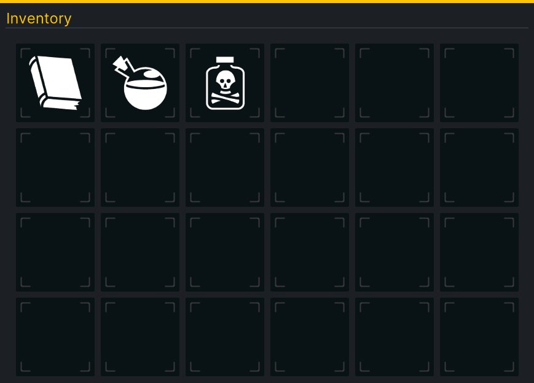
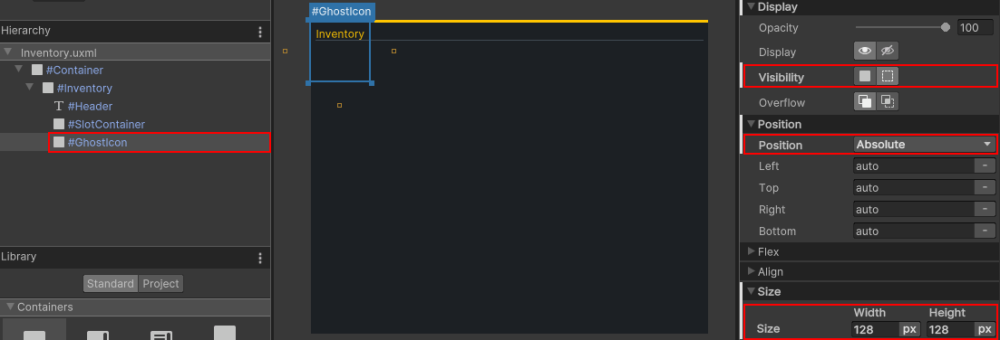
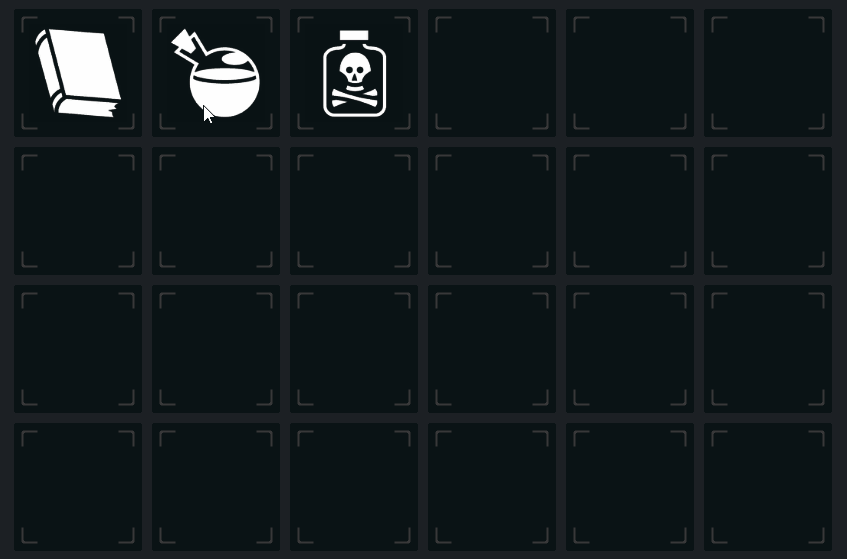

# Populate and interact with the UI
Now that you have an inventory that looks decent and has slots, it’s time to make it interactable! Before we jump into how the event system works, it’s probably a good idea to review GameController, a helper script that came bundled with the starter project. 

`GameController` generates a small item database that has three items in it. Each item has a friendly name, GUID, icon, and “CanDrop” boolean. It also contains the player's inventory data and an `OnInventoryChanged` event that is called on `Start`, which the UI will listen for. You can find the script on the **GameManager** GameObject in the **Demo** scene.

## Add a hook for OnInventoryChanged
Before you can populate or interact with the UI, you’ll need to give `InventorySlot` the ability to hold and drop items. Add the following code to `InventorySlot`:

```csharp
public void HoldItem(ItemDetails item)
{
    Icon.image = item.Icon.texture;
    ItemGuid = item.GUID;
}

public void DropItem()
{
    ItemGuid = "";
    Icon.image = null;
}
```

If InventorySlot is holding anything, the GUID and Icon will be set. If it’s not, they’ll be empty/null. 

It is time to populate the initial view based on the player's inventory. Add the following to the end of `InventoryUIController.Awake`:

```csharp
GameController.OnInventoryChanged += GameController_OnInventoryChanged;
```

Add the following new method:

```csharp
private void GameController_OnInventoryChanged(string[] itemGuid, InventoryChangeType change)
{
    //Loop through each item and if it has been picked up, add it to the next empty slot
    foreach (string item in itemGuid)
    {
        if (change == InventoryChangeType.Pickup)
        {
            var emptySlot = InventoryItems.FirstOrDefault(x => x.ItemGuid.Equals(""));
                        
            if (emptySlot != null)
            {
                emptySlot.HoldItem(GameController.GetItemByGuid(item));
            }
        }
    }
}

```
Save your scripts and push play in Unity. You should now have three items in the player’s inventory!



## Add drag and drop behavior
A “ghost icon” will appear when the player initiates a drag event on an InventorySlot. This lets you freely move the image around the screen without worrying about any funky repositioning logic. Create the ghost image by going back to **UI Builder** and adding a new **VisualElement** as a child of **Container**. **Name** it **GhostIcon**. Set the follow styles:

1. **Position**: Absolute
1. **Size** > **Width & Height**: 128x128
1. **Visibility**: Hidden



> Make sure that GhostIcon is the last child. Otherwise, it’ll appear behind some of the elements. You can set a temporary icon under **Background** > **Image** to see how it’ll render.

Add a reference to **GhostIcon** on `InventoryUIController` by adding a new global variable:

```csharp
//Global variable
private VisualElement m_GhostIcon;
```

Add this line to the end of `InventoryUIController.Awake` (or really just after you set m_Root):

```csharp
m_GhostIcon = m_Root.Query<VisualElement>("GhostIcon");
```

Since you are in `InventoryUIController`, let's wrap up adding the full drag/drop logic. Add two more global variables:

```csharp
private static bool m_IsDragging;
private static InventorySlot m_OriginalSlot;
```

Add a new `StartDrag` method:

```csharp
public void StartDrag()
{
    //Set tracking variables
    m_IsDragging = true;
    m_OriginalSlot = originalSlot;

    //Set the new position
    m_GhostIcon.style.top = position.y - m_GhostIcon.layout.height / 2;
    m_GhostIcon.style.left = position.x - m_GhostIcon.layout.width / 2;

    //Set the image
    m_GhostIcon.style.backgroundImage = GameController.GetItemByGuid(originalSlot.ItemGuid).Icon.texture;

    //Flip the visibility on
    m_GhostIcon.style.visibility = Visibility.Visible;
}
```

`StartDrag` is called by `InventorySlot.OnPointerDown` and its purpose is to, well, start the drag process. :D The first interesting bit of logic here is that the new position for `m_GhostIcon` is set via their style properties. By subtracting half of the height and width, you ensure that the m_GhostIcon appears center to the mouse. 

There are two more pointer events that need to be registered. Add the following code to the end of `InventoryUIController.Awake`:

```csharp
m_GhostIcon.RegisterCallback<PointerMoveEvent>(OnPointerMove);
m_GhostIcon.RegisterCallback<PointerUpEvent>(OnPointerUp);

```
Add the final methods for  `InventoryUIController` - `OnPointerMove` and `OnPointerUp`:

```csharp
private void OnPointerMove(PointerMoveEvent evt)
{
    //Only take action if the player is dragging an item around the screen
    if (!m_IsDragging)
    {
        return;
    }

    //Set the new position
    m_GhostIcon.style.top = evt.position.y - m_GhostIcon.layout.height / 2;
    m_GhostIcon.style.left = evt.position.x - m_GhostIcon.layout.width / 2;

}

private void OnPointerUp(PointerUpEvent evt)
{
    if (!m_IsDragging)
    {
        return;
    }

    //Check to see if they are dropping the ghost icon over any inventory slots.
    IEnumerable<InventorySlot> slots = InventoryItems.Where(x => x.worldBound.Overlaps(m_GhostIcon.worldBound));

    //Found at least one
    if (slots.Count() != 0)
    {
        InventorySlot closestSlot = slots.OrderBy(x => Vector2.Distance(x.worldBound.position, m_GhostIcon.worldBound.position)).First();
        
        //Set the new inventory slot with the data
        closestSlot.HoldItem(GameController.GetItemByGuid(m_OriginalSlot.ItemGuid));
        
        //Clear the original slot
        m_OriginalSlot.DropItem();
    }
    //Didn't find any (dragged off the window)
    else
    {
        m_OriginalSlot.Icon.image = GameController.GetItemByGuid(m_OriginalSlot.ItemGuid).Icon.texture;
    }

    //Clear dragging related visuals and data
    m_IsDragging = false;
    m_OriginalSlot = null;
    m_GhostIcon.style.visibility = Visibility.Hidden;

}
```

1. `OnPointerMove` is pretty straight forward - it’s just taking the latest mouse position and setting m_GhostIcon’s position to it.
2. `OnPointerUp` handles the logic for determining whether the player let go of the mouse while it was hovering over an inventory slot. You can easily check whether one `VisualElement` overlaps another by calling `VisualElement.worldBound.Overlaps()`. In this case, if slot(s) were found then they will be ordered by distance and the closest one will get the new item. 

> I highly recommend you take a bit of time to read about how UI Toolkit dispatches events, which you can do [here](https://docs.unity3d.com/Manual/UIE-Events-Dispatching.html). This will be especially important if you have multiple UI Documents in your scene.

### Trigger the drag process
Each `InventorySlot` will monitor for `OnPointerDown` which will indicate whether the drag event should be triggered. Register a new event listener at the end of the `InventorySlot` constructor:

```csharp
RegisterCallback<PointerDownEvent>(OnPointerDown);
```

Create a new OnPointerDown method with the following code:

```csharp
private void OnPointerDown(PointerDownEvent evt)
{
    //Not the left mouse button
    if (evt.button != 0 || ItemGuid.Equals(""))
    {
        return;
    }

    //Clear the image
    Icon.image = null;

    //Start the drag
    InventoryUIController.StartDrag(evt.position, this);
}

```

**OnPointerDown** will first make sure that the left button is pushed and that the `InventorySlot` is actually carrying an item. If it is, then it’ll call `InventoryUIController.StartDrag()`. Here’s the full list of the button to integer mapping:

1. **Left**: 0
2. **Right**: 1
3. **Middle**: 2

That’s it! Hit play and see your drag and drop in action:




### [Previous (Code the Inventory Slots)](./pt4.md)    |     [Next (Bonus: Samples & Debugging the UI)](./pt6.md)


