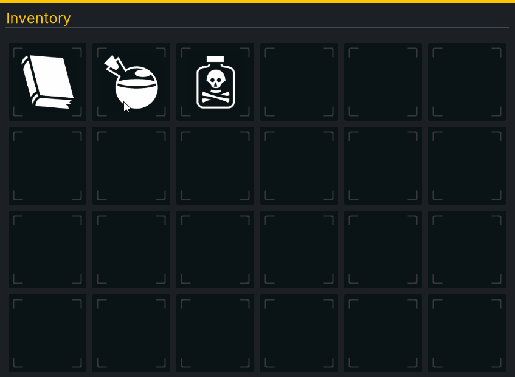

#  Create an in-game Inventory UI with UI Toolkit

## Learn the basics of UI Toolkit, the replacement for IMGUI and the UGUI by creating an in-game inventory.

> You will need Unity 2020.2.2f1 to follow along. This tutorial assumes knowledge of C# and Unity.

A great UI is one of the most important parts of any game. It needs to be responsive and intuitive while looking awesome. In this tutorial, you’ll learn the basics of Unity’s new UI system, called UI Toolkit, by creating an in-game inventory system where your player can drag and drop items to move them around. 

## Learning Outcomes 
What is  great about learning UI Toolkit is you can apply the same skills to create custom UI and extensions for the Unity Editor, runtime debugging tools, and runtime UI for your games. At the end of this tutorial you will be able to:

- Design UIs by using the UI Builder tool.
- Design UIs through C# and USS (for styling).
- Instantiate your UI at runtime.
- Manipulate VisualElement styles at runtime, including setting a new position.
- Register and handle events for the UI. 

## Prerequisites

1. You need [Unity 2020.2.1f1](https://unity3d.com/get-unity/download) or later to follow along with this tutorial.
2. This tutorial assumes you have basic knowledge of Unity and intermediate knowledge of C#.
3. Download the starter project from the [GitHub repository](https://github.com/Yecats/GameDevTutorials).

## Table of Contents

1. [Getting Started](./articles/pt1.md)
2. [Design the Inventory UI](./articles/pt2.md)
3. [Add the Inventory UI to the game](./articles/pt3.md)
4. [Code the Inventory Slots](./articles/pt4.md)
5. [Populate and interact with the UI](./articles/pt5.md)
6. [Bonus: Samples & Debugging the UI](./articles/pt6.md)
7. [Challenge: Add a quick slot UI](./articles/pt7.md)

## Resources
This project uses assets from Game-Icons.net and inspiration from from Wenrexa's free UI Kit #3 for the design.

1. [Game-Icons.net](http://game-icons.net/)
2. [Wenrexa: Free UI KIT #3](https://wenrexa.itch.io/ui-different03)

