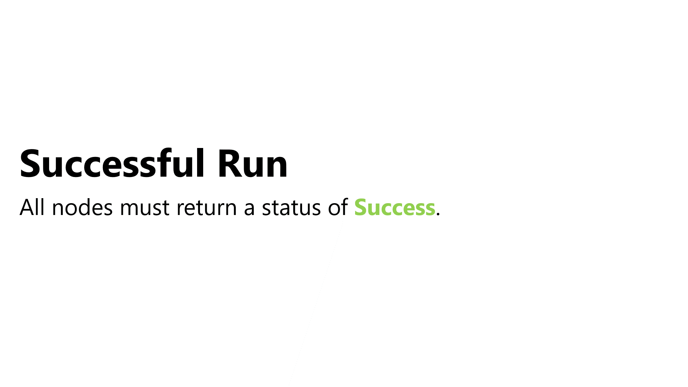
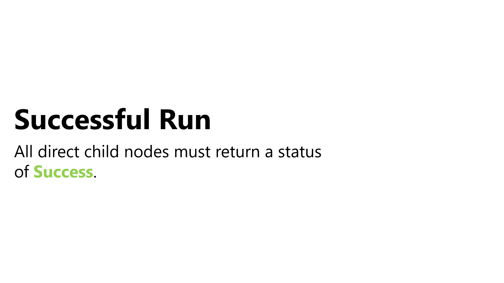

# Understanding Behavior Trees
At its core, a Behavior Tree is a group of nodes. There are four categories of nodes, which all inherit from the same base class:

| Type          | Description                                               | Number of Children    |
|-----------    |---------------------------------------------------------- |--------------------   |
| Action        | Takes an action within the game.                          |          0            |
| Condition     | Tests an element of the game.                             |          0            |
| Composite     | Contains instructions on how to run its children nodes.   |          N            |
| Decorator     | Modifies the behavior of its child.                      |          1            |

Each time a node runs, it has the possibility to return one of three status codes:

1. **Success:** The node's behavior has finished and ran as intended.
2. **Failure:** The node's behavior has finished and did not run as intended.
3. **Running:** The node's behavior is still executing. 

Let us consider an example. You have an AI that needs to navigate through a locked door. Before they can, they would need a **condition** to check that they have the key to the door. If they do, they will need to take **actions** to unlock and open the door. All of this would be driven with a **composite**, likely a Sequence.

> We'll explore standard composites in depth later. A Sequence is a composite you will use frequently. Its goal is to successfully run all its children. If any child returns a failure, it will stop running, no matter how many children are left, and return the status code of failure. If all children successfully run, it will return the status code of Success.  

By using the **Sequence composite**, you ensure that if the condition, "**Do they have the key?**", fails then the rest of the child nodes will not run. If it succeeds, the Sequence will run **Unlock Door** and **Open Door**.

We are missing a decorator in this example. Let us change it. Instead of wanting the AI to have the key, you want them to bash open the door if they do not have it. Since the "**Do they have the key?**" check needs to return success for the Sequence to continue, you'll want to **Invert** the result with a decorator.

> An Inverter decorator is a very handy tool and simply flips the result. Nodes that would return success now return failure, and those that would return failure now return success. We will explore different decorator types later.

Here is what would happen when this branch runs:

1. The Inverter will execute it's child node, **Do they have the key?**. 
2. If the condition returns **Success**, the Inverter will flip the result to be a **Failure**. In that case, the Sequence will stop running and return **Failure** because one of its children failed.
3. If the condition returns **Failure**, the Inverter will flip the result to be a **Success**. In that case, the Sequence continue and run Bash Door.

### [Previous (Getting Started)](./pt1-getting-started.md)    |     [Next (Create the base node)](./pt3-create-base-node.md)

