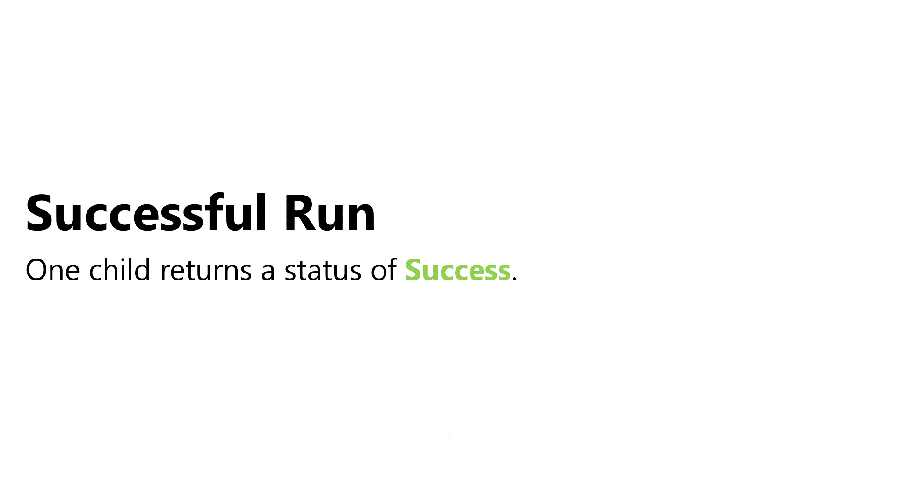

# Create General Composites

Composites are guidelines for how branches (child nodes) should be run. A composite can have any number of children nodes. There are a handful of standard composites that you will use regularly. In this tutorial, you will create two types - the Sequence and the Selector. 

> Behavior Tree Visualizer has several more composites in the Standard Nodes sample project. Go [here](https://github.com/Yecats/UnityBehaviorTreeVisualizer/wiki/Standard-Behavior-Tree-Nodes) for more details.

Both composites will inherit from a `Composite` class. Create a new **abstract** class in **/WUG/Scripts/Behaviors** called `Composite`, which will inherit from `Node`. Add the following code:

```csharp
public abstract class Composite : Node
{
    protected int CurrentChildIndex = 0;

    //constructor
    protected Composite(string displayName, params Node[] childNodes)
    {
        Name = displayName;

        ChildNodes.AddRange(childNodes.ToList());
    }
}
```

This ensures that every `Composite` will take at least two parameters - a `displayName` and an array of `childNodes`. `CurrentChildIndex` will be used to track the current child that the node is evaluating. This ensures you 
 do not evaluate children that were already run.

## Sequence
In the [Understanding Behavior Trees](./pt2-understanding-behavior-trees.md) section we touched a bit on a Sequence composite. Unlike the Selector, the goal of a Sequence is to run all its children. If any child fails to run (returns `NodeStatus.Failure`) then the whole Sequence will return `NodeStatus.Failure`.


Create a new class in **/WUG/Scripts/Behaviors/Composites** called **Sequence**, which will inherit from `Composite`. Add the following constructor and code for `OnRun()`:

```csharp
public Sequence(string displayName, params Node[] childNodes) : base(displayName, childNodes) { }

protected override NodeStatus OnRun()
{
    //Check the status of the last child
    NodeStatus childNodeStatus = (ChildNodes[CurrentChildIndex] as Node).Run();

    //Evaluate the current child node. If it's failed - sequence should fail. 
    switch (childNodeStatus)
    {
        //Child failed - return failure
        case NodeStatus.Failure:
            return childNodeStatus;
        //It succeeded - move to the next child
        case NodeStatus.Success:
            CurrentChildIndex++;
            break;
    }

    //All children have run successfully - return success
    if (CurrentChildIndex >= ChildNodes.Count)
    {
        return NodeStatus.Success;
    }

    //The child was a success but we still have more to do - so call this method again.
    return childNodeStatus == NodeStatus.Success ? OnRun() : NodeStatus.Running;
}
```

`OnRun()` will iterate through a new child every time it is called and will evaluate the status of the child. There are three `NodeStatus` codes that the child node could return:

1. `NodeStatus.Success`: The child node succeeded, so the sequence will iterate and move on to the next child.
2. `NodeStatus.Failure`: The child node failed, so the sequence will fail as well, thereby returning `NodeStatus.Failure`.
3. `NodeStatus.Running`: The child node is still running, so the sequence will continue to run it.

Once all children have successfully run, the Sequence will return `NodeStatus.Success`.

Finally, add the following code for `OnReset()`:

```csharp
protected override void OnReset()
{
    CurrentChildIndex = 0;

    for (int i = 0; i < ChildNodes.Count; i++)
    {
        (ChildNodes[i] as Node).Reset();
    }
}
```

`OnReset()` will iterate through each child and call their `Reset()` logic. It will also reset the index for `CurrentChildIndex` to 0, ensuring that it is setup properly for the next run.

## Selector
The Selector's goal is to run just one of its children Successfully. It will run each child in order until until one of them returns `NodeStatus.Success`. If all children return `NodeStatus.Failure` then it will also return `NodeStatus.Failure`.



Create a new class in **/WUG/Scripts/Behaviors/Composites** called **Selector**, which will inherit from `Composite`. Add the following constructor and code for `OnRun()`:

```csharp
public Selector(string displayName, params Node[] childNodes) : base(displayName, childNodes) { }

protected override NodeStatus OnRun()
{
    //We've reached the end of the ChildNodes and no one was successful
    if (CurrentChildIndex >= ChildNodes.Count)
    {
        return NodeStatus.Failure;
    }

    //Call the current child
    NodeStatus nodeStatus = (ChildNodes[CurrentChildIndex]as Node).Run();

    //Check the child's status - failure means try a new child, Success means done.
    switch (nodeStatus)
    {
        case NodeStatus.Failure:
            CurrentChildIndex++;
            break;
        case NodeStatus.Success:
            return NodeStatus.Success;
    }

    //If this point as been hit - then the current child is still running
    return NodeStatus.Running;
}
```

`OnRun()` will iterate through a new child every time it is called and will evaluate the status of the child. There are three `NodeStatus` codes that the child node could return:

1. `NodeStatus.Success`: The child node succeeded, so the Selector will be complete and return `NodeStatus.Success`. 
2. `NodeStatus.Failure`: The child node failed, so the Selector will iterate and move on to the next child.
3. `NodeStatus.Running`: The child node is still running, so the Selector will continue to run it.

If all children have failed, the Selector will return `NodeStatus.Failure`, otherwise it will return `NodeStatus.Running` while it runs each child.

Finally, add the following code for `OnReset()`:

```csharp
protected override void OnReset()
{
    CurrentChildIndex = 0;

    for (int i = 0; i < ChildNodes.Count; i++)
    {
        (ChildNodes[i] as Node).Reset();
    }
}
```

`OnReset()` does the same thing as the Sequence - iterates through each child and call their `Reset()` logic. 

## Wrap-up
In this section you have learned about composites, which are a core functionality of behavior trees as they provide instructions on how to run their branch. Selector and Sequence are two common and useful composites, but they are not the only ones that you will likely need for your game. Here are three more types that could be useful:

1. **Parallel**: Runs all the children at the same time. This is great if you want to trigger an animation while unlocking a door, for example.
2. **RandomSelector & RandomSequence**: These would shuffle the children before iterating through them - giving more of a dynamic feel to the AI.

> Behavior Tree Visualizer has examples of these and more in the Standard Behavior Tree Nodes sample project. Go [here](https://github.com/Yecats/UnityBehaviorTreeVisualizer/wiki/Standard-Behavior-Tree-Nodes) for more details.

### [Previous (Create the base node)](./pt3-create-base-node.md)    |     [Next (Create general decorators)](./pt5-create-general-decorators.md/)