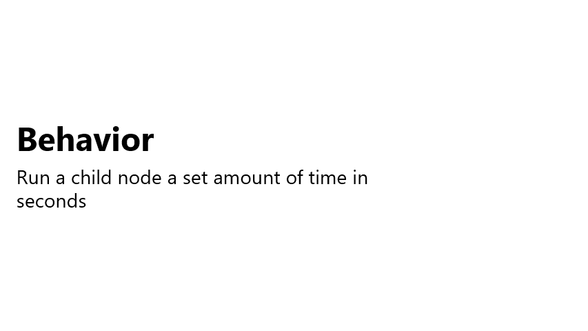

# Create general decorators

Decorators are a way to alter the behavior of an instance of a class. Unlike a composite, a decorator only ever has one child. That child could be an action node, a condition node or even a composite itself. 

> Decorator Pattern is a design pattern in object-oriented programming. You can read more about it [here](https://en.wikipedia.org/wiki/Decorator_pattern).

There are many different decorators that are useful. This tutorial only needs two, the `Inverter` and the `Timer`.

Before we get started with each of these, we will need a `Decorator` class to inherit from. Create a new **abstract** class in **/WUG/Scripts/Behaviors** called `Decorator`, which will inherit from `Node`. Add the following code:

```csharp
public abstract class Decorator : Node
{
    public Decorator(string displayName, Node node)
    {
        Name = displayName;
        ChildNodes.Add(node);
    }
}
```

The main difference between this and the `Composite` script, is that the `Decorator` will only accept a single child, rather than an array. 

## Inverter

In the [Understanding Behavior Trees](./pt2-understanding-behavior-trees.md) section we touched a bit on the `Inverter` decorator earlier in this tutorial. The concept behind it is simple, it will flip the result of its child node before passing it up the tree:

1. `NodeStatus.Success` will now be `NodeStatus.Failure`.
2. `NodeStatus.Failure` will now be `NodeStatus.Success`.
3. The Inverter will not do anything special if the child returns `NodeStatus.Running`, as this means the child is still processing its logic.


Let's get it added to the project:

1. Add a new **Decorators** folder in **/WUG/Scripts/Behaviors/**. 
2. Create a new class in the **Decorators** folder called **Inverter**, which will inherit from `Decorator`. Add the following code for the **constructor**, `OnRun` and `OnReset` methods:

```csharp
    public class Inverter : Decorator
    {
        public Inverter(string displayName, Node childNode) : base(displayName, childNode) { }

        protected override void OnReset() { }

        protected override NodeStatus OnRun()
        {

            //Confirm that a valid child node was passed in the constructor
            if (ChildNodes.Count == 0 || ChildNodes[0] == null)
            {
                return NodeStatus.Failure;
            }

            //Run the child node
            NodeStatus originalStatus = (ChildNodes[0] as Node).Run();

            //Check the status of the child node and invert if it is Failure or Success
            switch (originalStatus)
            {
                case NodeStatus.Failure:
                    return NodeStatus.Success;
                case NodeStatus.Success:
                    return NodeStatus.Failure;
            }

            // Otherwise, it's still running or returning an Unknown code
            return originalStatus;

        }
    }
```
The `OnRun()` method will first confirm it has a valid child node. If it does, it'll run it and check the status. If the child returned `NodeStatus.Success` or `NodeStatus.Failure`, the status will be flipped and returned otherwise it returns the original. 

## Timer
The goal of `Timer` is to continue to run the child node until the timer expires. The example below would cause the AI to make lock picks for two seconds. in the example below the AI must wait two seconds before making a lock pick and being able to pick the lock of the door. 



Create a new class in the **Decorators** folder called **Timer**, which will inherit from `Decorator`. Add the following code for the global variables and constructor:

```csharp
public class Timer : Decorator
{
    private float m_StartTime;
    private bool m_UseFixedTime;
    private float m_TimeToWait;

    public Timer(float timeToWait, Node childNode,  bool useFixedTime = false) : base($"Timer for {timeToWait}", childNode) 
    {
        m_UseFixedTime = useFixedTime;
        m_TimeToWait = timeToWait;
    }
}
```

The constructor for `Timer` takes two new parameters:

1. **timeToWait**: Amount of time to wait in seconds.
2. **useFixedTime**: Whether to use Time.fixedTime (true) or Time.time (false).

Next, add the `OnRun` and `OnReset` methods:

```csharp
protected override void OnReset() { }
protected override NodeStatus OnRun()
{
    //Confirm that a valid child node was passed in the constructor
    if (ChildNodes.Count == 0 || ChildNodes[0] == null)
    {
        return NodeStatus.Failure;
    }

    // Run the child node and calculate the elapsed
    NodeStatus originalStatus = (ChildNodes[0] as Node).Run();

    //If this is the first eval, then the start time needs to be set up.
    if (EvaluationCount == 0)
    {
        StatusReason = $"Starting timer for {m_TimeToWait}. Child node status is: {originalStatus}";
        m_StartTime = m_UseFixedTime ? Time.fixedTime : Time.time;
    }

    //Calculate how much time has passed
    float elapsedTime = Time.fixedTime - m_StartTime;

    //If more time has passed than we wanted, it's time to stop
    if (elapsedTime > m_TimeToWait)
    {
        StatusReason = $"Timer complete - Child node status is: { originalStatus}";
        return NodeStatus.Success;
    }

    //Otherwise, keep running
    StatusReason = $"Timer is {elapsedTime} out of {m_TimeToWait}. Child node status is: {originalStatus}";
    return NodeStatus.Running;

}
```

`OnRun` will setup the timer when the node runs for the first time. Each subsequent run will confirm that the timer has not expired. Every time `OnRun` is called, it will run the child node. 

## Wrap Up
In this section you learned about decorators and how they can be useful for changing the behavior of an instance of a node. There are many more decorators that can be particularly useful, such as:

1. **UntilFail**: Continues to run the child node until the child returns a status of Failure.
2. **Repeater**: Run the child node a specified amount of times before exiting.
3. **Delay**: Executes a timer and then runs the child node once.

> Behavior Tree Visualizer has examples of these and more in the Standard Behavior Tree Nodes sample project. Go [here](https://github.com/Yecats/UnityBehaviorTreeVisualizer/wiki/Standard-Behavior-Tree-Nodes) for more details.

### [Previous (Create general composites)](./pt4-create-general-composites.md)    |     [Next (A closer look at the demo project)](./pt6-closer-look-at-demo-project.md/)

