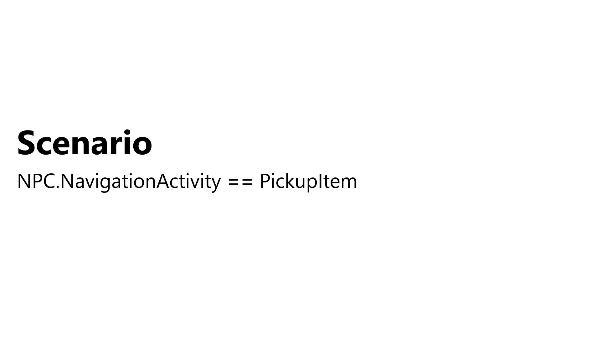
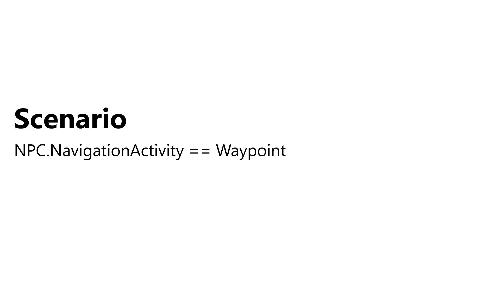

# A closer look at the demo project

Before you jump into making the game specific conditions and actions, we should go over what you will be creating. In a nutshell, you will tell an NPC character to navigate to a random waypoint and pick up all the items that are within 5 meters. This will continue until all items in the scene are picked up. The demo project that you downloaded came with a scene already setup and several scripts that the behavior tree will interact with. 

## The scene

Open the **Demo** scene, located under **Assets/WUG/Scenes**. There are three groups objects that are of interest in this scene:

1. **NPC** is the character that will be driven by your behavior tree. 
2. **Waypoints** are five empty game objects spread across the scene.
3. **Items** are 21 prefabs that have a box collider as a trigger and an `Item` script. These are all grouped around a waypoint.

## The scripts

There are four scripts already included in this project:

1. `GameManager` provides a top level view of the game by managing references to the NPC, Items and Waypoints. It has two helper methods that your behavior tree will use - `GetClosestItem()` and `GetNextWayPoint()`.
2. `Item` uses the `OnTriggerEnter()` method to pickup the item via `GameManager.PickUpItem()`.
3. `GeneralExtensions` contains a `Shuffle()` static helper method used by `GameManager` to randomize the waypoint list during `Start`.
4. `NonPlayerCharacter` has a reference to the `NavMeshAgent` and the enum for tracking the `NavigationActivity`, which is either `Waypoint` or `PickupItem`.

## The behavior tree
The behavior tree you will be writing may look complicated, but it is a simple one to traverse. Here is what you will be making:

By having the first node as a **Selector**, we ensure that only one **sequence** (branch) will execute each run. Here is what each branch will do:

The **left branch** handles the logic for picking up all items within 5f of the waypoint. If there are no items, then the branch will set **Navigation Activity** to **Waypoint**. This will force the **left branch** to fail on the next condition check, which will ensure the **right branch** is evaluated. Here is an example of the evaluation for navigating the AI to the next item:

The **right branch** handles the logic for navigating to a waypoint. Once the AI arrives, it will use the **timer decorator** to pause for 2 seconds before changing the **Navigation Activity** from **Waypoint** to **PickupItem**. This switch will trigger the **left branch** to run the next time the tree is evaluated. Here is an example of the evaluation for moving the AI to the next waypoint:

### [Previous (Create general decorators)](./pt5-create-general-decorators.md)    |     [Next (Create custom conditions)](./pt7-create-custom-conditions.md)

