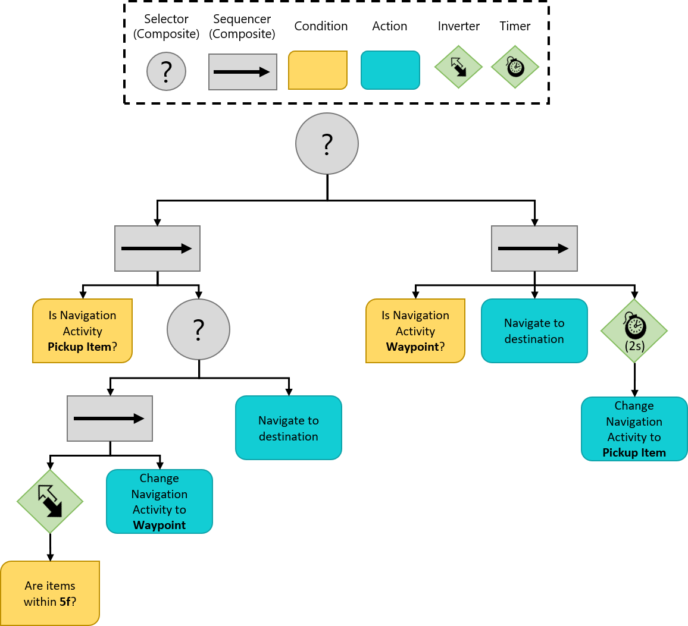
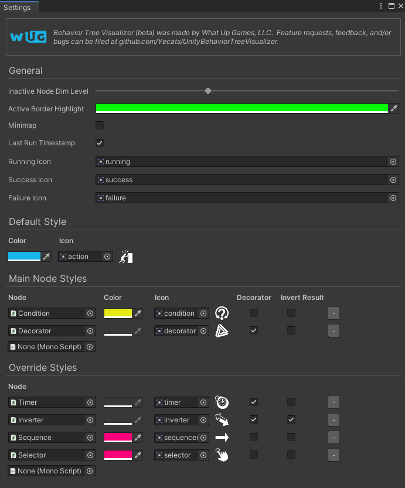

# Building and running the Tree

Finally! The time has come to put the tree together and see the AI in action. You will use a coroutine to run the behavior tree, which also lets you control how often you evaluate the nodes through the `WaitForSeconds` `YieldInstruction`.

> This tutorial does not cover coroutines in depth. They are very handy and worth reading on if you are not familiar. See the [Unity Manual](https://docs.unity3d.com/Manual/Coroutines.html) for more information.

## Build
The first thing that you will do is build the tree. Open the `NonPlayerCharacter` script, located in the **Assets/WUG/Scripts** folder. 

Behavior Tree Visualizer requires the use of `IBehaviorTree` to read runtime trees. Implement  `IBehaviorTree` by changing this line:

```csharp
public class NonPlayerCharacter : MonoBehaviour
```

to:

```csharp
public class NonPlayerCharacter : MonoBehaviour, IBehaviorTree
```

`IBehaviorTree` sets the contract of using a property to store your behavior tree. Add the following global variable and new method:

```csharp
public NodeBase BehaviorTree { get; set; }

private void GenerateBehaviorTree()
{
    BehaviorTree = new Selector("Control NPC",
                        new Sequence("Pickup Item",
                            new IsNavigationActivityTypeOf(NavigationActivity.PickupItem),
                            new Selector("Look for or move to items",
                                new Sequence("Look for items",
                                    new Inverter("Inverter",
                                        new AreItemsNearBy(5f)),
                                    new SetNavigationActivityTo(NavigationActivity.Waypoint)),
                                new Sequence("Navigate to Item",
                                    new NavigateToDestination()))),
                        new Sequence("Move to Waypoint",
                            new IsNavigationActivityTypeOf(NavigationActivity.Waypoint),
                            new NavigateToDestination(),
                            new Timer(2f,
                                new SetNavigationActivityTo(NavigationActivity.PickupItem))));
}
```

`GenerateBehaviorTree()` is a bit messy to read and as I am sure you can imagine, the larger a tree gets the more difficult it becomes. In a nutshell, the code is creating the same structure that was in the diagram:



> **Tip:** Use indenting to help keep track of the current level of your behavior tree. The Behavior Tree Visualizer is a good way to pinpoint any mistakes in nesting at runtime.

The last thing to do is add the coroutine logic. Add two more global variables:

```csharp
private Coroutine m_BehaviorTreeRoutine;
private YieldInstruction m_WaitTime = new WaitForSeconds(.1f);
```

Add two more methods - `RunBehaviorTree()` and Unity's `OnDestroy()`:

```csharp
private IEnumerator RunBehaviorTree()
{
    while (enabled)
    {
        if (BehaviorTree == null)
        {
            $"{this.GetType().Name} is missing Behavior Tree. Did you set the BehaviorTree property?".BTDebugLog();
            continue;
        }

        (BehaviorTree as Node).Run();

        yield return m_WaitTime;
    }
}

private void OnDestroy()
{
    if (m_BehaviorTreeRoutine != null)
    {
        StopCoroutine(m_BehaviorTreeRoutine);
    }
}
```

`RunBehaviorTree()` will first make sure that the `BehaviorTree` property is not null. If it is not, it will call `Run()` on the top level node. This will trigger the evaluation down the tree. You will use the Behavior Tree Visualizer to see how it is running shortly. The last thing you need to do is update `Start` to create the tree and start the coroutine:

```csharp
private void Start()
{
    MyNavMesh = GetComponent<NavMeshAgent>();
    MyActivity = NavigationActivity.Waypoint;

    GenerateBehaviorTree();
    
    if (m_BehaviorTreeRoutine == null && BehaviorTree != null)
    {
        m_BehaviorTreeRoutine = StartCoroutine(RunBehaviorTree());
    }
}
```

## Setup Behavior Tree Visualizer
Behavior Tree Visualizer (BVT) is designed to scan the scene for active behavior trees and will group all of them into a toggle for drop down. You have been integrating with the tool throughout this tutorial. There are only two more steps left and you will have a working representation of your tree. 

The first thing you need to do is update the `Node` script to notify BVT when the `NodeStatus` or `StatusReason` has changed. Open the `Node` script.

Add a new global variable:

```csharp
private string m_LastStatusReason { get; set; } = "";
```

You will need a new if statement between `NodeStatus nodeStatus = OnRun();` and `EvaluationCount++;`. Your OnRun method should now look like:

```csharp
public virtual NodeStatus Run()
{
    NodeStatus nodeStatus = OnRun();

    //Start of new code
    if (LastNodeStatus != nodeStatus || !m_LastStatusReason.Equals(StatusReason))
    {
        LastNodeStatus = nodeStatus;
        m_LastStatusReason = StatusReason;
        OnNodeStatusChanged(this);
    }
    //End of new code

    EvaluationCount++;

    if (nodeStatus != NodeStatus.Running)
    {
        Reset();
    }

    return nodeStatus;
}
```

Next, you need to set the style of your nodes. This includes the highlight border, the title bar color, and icons. The package comes with several icons for styling. Click on **What Up Games** > **Behavior Tree Visualizer** > **Settings**.

Before configuring the settings, it is useful to understand the order of operations that BVT performs when deciding how a node should be styled:

1. First, each node is checked against the Override Styles section.
2. If no Override exists, the node is checked against the Main Node Styles section to see if the derived type exists.
3. Finally, if the Main Node Styles check fails, it is stylized with the settings in Default Style

> Behavior Tree Visualizer has several useful settings that are all documented on the Wiki. You can read more [here](https://github.com/Yecats/UnityBehaviorTreeVisualizer/wiki/Configuring-the-Settings).

Here are the settings that I use:



## See it in action
That is it! It is now time to see your AI move around and watch the tree. Here is how you can see your tree in action:

1.  Open Behavior Tree Visualizer via **What Up Games** > **Behavior Tree Visualizer**.
2.  Push Play in Unity.
3.  Once the AI starts moving, click **Scan Scene** in BVT.
4.  Click the **Select Behavior Tree** drop down and select **NPC**.

> It is possible to add a button to the Inspector window of the NPC to launch BVT that way. See "[Add a 'Draw Behavior Tree' Button to the Inspector](https://github.com/Yecats/UnityBehaviorTreeVisualizer/wiki/Add-a-%22Draw-Behavior-Tree%22-Button-to-the-Inspector)" for more details.

You should now see your AI pick up items and a visual graph showing you which part of the behavior tree is currently running.


### [Previous (Create custom actions)](./pt8-create-custom-actions.md/) 

