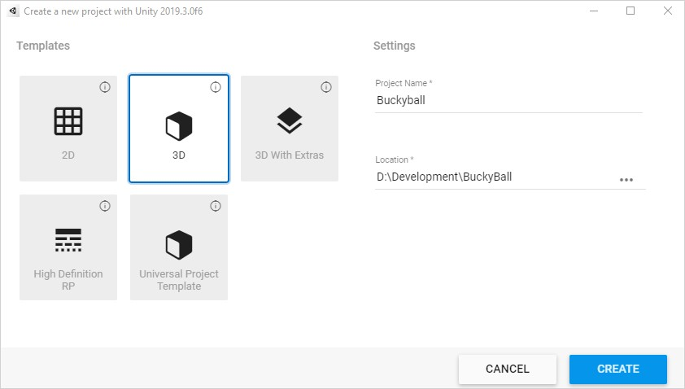
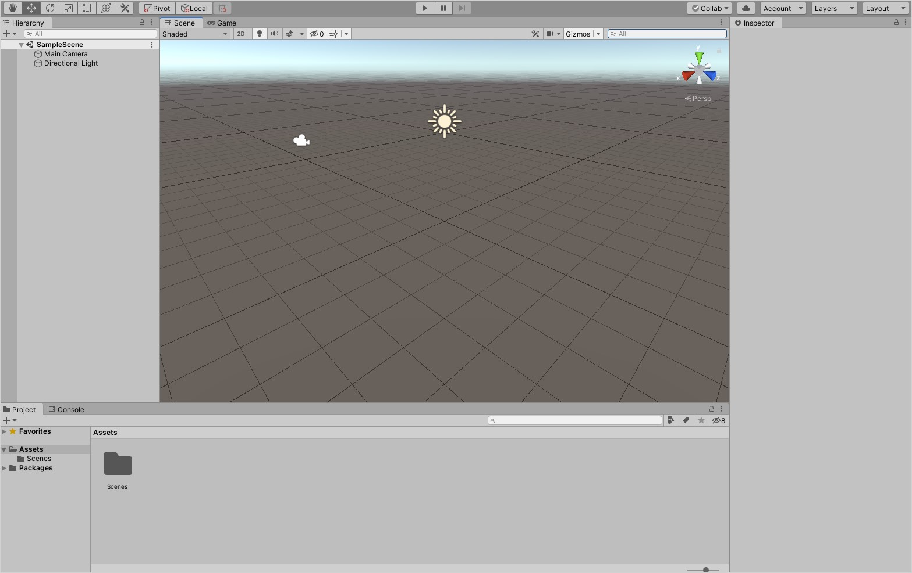
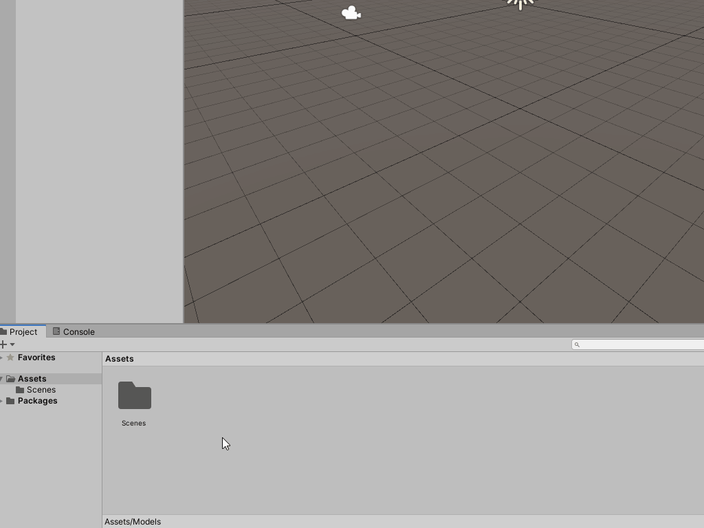

# Getting started

The [Unity Hub](https://docs.unity3d.com/Manual/GettingStartedInstallingHub.html) is a management tool that enables you to control multiple Unity editor versions and projects. You will use it when installing new versions of the Unity editor, loading projects and creating new projects. To start, you will create a new project.
1. Start the **Unity Hub** and click on the **New** button.
2. **Name** the project **BuckyBall** and specify the **save location** on your hard drive. Leave the **template** as **3D**.
3. Click **Create**.

Once Unity has loaded with the project you will see six windows that you’ll use on a regular basis:

1. **Project**: Contains all files related to your project.
2. **Scene**: Interactive window for creating levels.
3. **Hierarchy**: List of every GameObject in the current scene.
4. **Inspector**: List of components that define the purpose of a selected GameObject.
5. **Game**: Rendered camera view of your game. This is where you’ll test and play it.
6. **Console**: Displays logs of messages, warnings and errors.

> **Note**: Don’t worry if some of these do not make sense yet – you will learn more of the concepts and interact with the windows throughout the tutorial.

## Setup your project
A project is made up of many types of **assets**. An asset is a representation of any item in your game, such as **models**, **images**, **scenes**, **scripts** and more. It is important to keep your assets organized as you will have many.

In this project you will use two types of assets, models and scripts, which will need their own folders:

1. **Right click** in the project window and go to **Create** > **Folder**. Name it **Models**.
2. Add another new folder and name it Scripts.

The models that you will be using can be downloaded by cloning the GitHub repository. Once downloaded, extract the models located in the **starter** > **models** folder into the **Assets** > **Models** folder in your project.

### [Previous (Introduction)](../readme.md)    |     [Next (Create the world)](./pt2-create-the-world.md)
