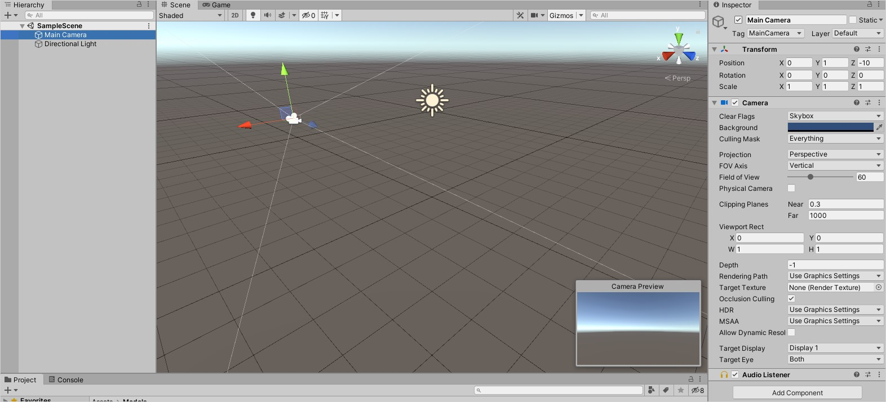
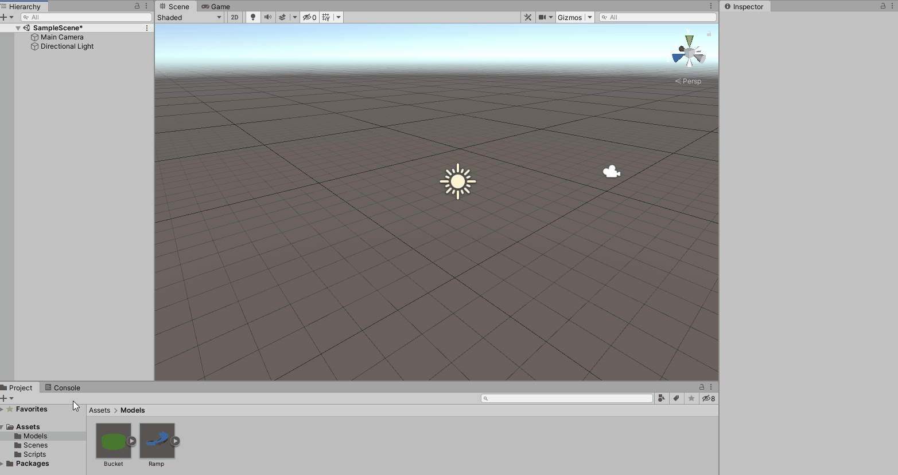
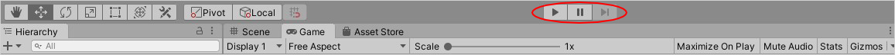

# Create the world
The **Scene** is your view into the world that you are creating. It’s used to set up the environment, characters, cameras, lights, and more. A scene is made up of a series of **GameObjects**. A GameObject is best thought of as an empty container where you define its purpose by adding **components** to it. A component gives functionality to its GameObject.

To explore this further, click on the **Main Camera** within the **Hierarchy** window. The **Inspector** window will populate with three out-of-the-box components that define the GameObject:
1. **Transform**: Defines the **position**, **rotation** and **scale** (size) within the scene. All game objects will have a transform.
2. **Camera**: Configures the GameObject to behave like a camera.
3. **Audio Listener**: Tells your game to pick up audio and play it back through the device’s speakers.

## Set up the scene
You’ll be setting up a scene that has a **ramp**, a **bucket** and a **ball**. When running the scene, the ball will roll off the ramp and land in the bucket.

First, add the **ramp** and **bucket** to your scene:

1. **Open** the **Models** folder in the **Projects** window.
2. **Drag** the **Ramp** model to the **Hierarchy** window. This will add it to the scene. Set the **transform** **position** to **(X:0, Y:1.25, Z:0)**.
3. **Drag** the **bucket** model into the **Hierarchy** window. Set the **transform** **position** to **(X:-1.5, Y:0, Z:1)**.

Unity has several primitive objects that can be used in your game. A one-meter sphere will be used for the ball.

1. **Right** **click** in the **Hierarchy** window and go to **3D** **Object** > **Sphere**.
2. In the **Inspector**, **rename** the **Sphere** to **Ball**.
3. Position the sphere at the top of the ramp by setting the **Transform’s position** to **(X:-0.85, Y:3.75, Z:1)**.

Press the Play button located at the top of the editor to see what happens when running the game.

Spoiler: Nothing happens, and the camera is positioned horribly! First, let’s fix the camera:

1. **Select** the **Main Camera** GameObject.
2. Set the **Position** to **(X:0.25, Y:6.5, Z:6.8)** and the **Rotation** to **(X:33, Y:190, Z:0)**.

**Select** the **Game** tab to see where the camera has moved to. Feel free to adjust the **Position** and **Rotation** if you want a different view.

### [Previous (Getting started)](./pt1-getting-started.md)    |     [Next (Add some physics)](./pt3-add-some-physics.md)