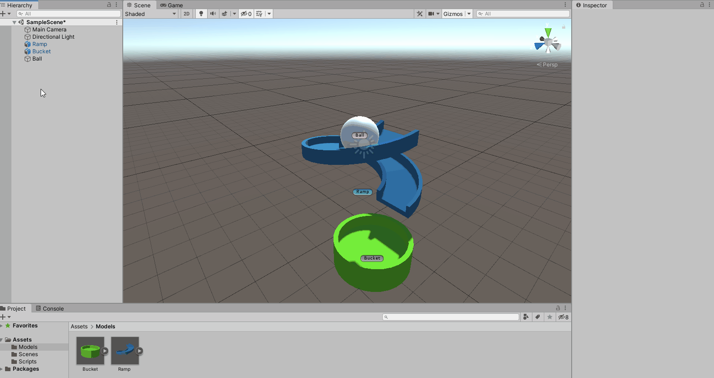
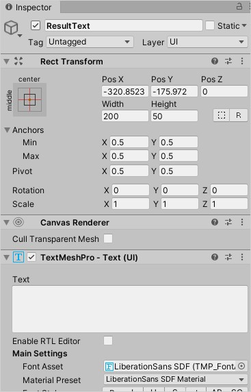
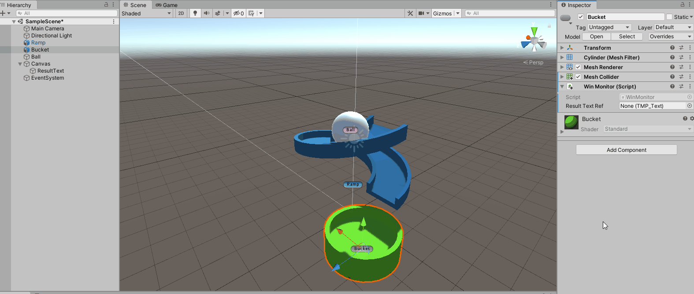
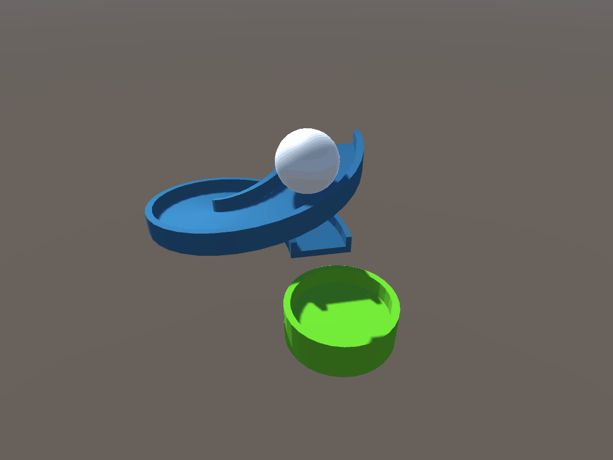

# Display a message
It would be more engaging to show the player a “Success!” when the ball lands in the bucket. To display text, you’ll need a GameObject with a text component.

1. Right click in the **Hierarchy** and go to **UI** > **Text – Text Mesh Pro**.
2. A **window** will appear called **TMP Importer**. Click **Import TMP Essentials**. Once done, close the window.



Two new GameObjects have been added to the scene – **Canvas** and **Text (TMP)**. Select **Text (TMP)** and **rename** it to **ResultText**. Clear “**New Text**” from the **Text property** of the **TextMeshPro – Text (UI)** component. 



## Define the behavior
Next, you will write C# code to update the UI with “Success!”. 

1. In the **Scripts** folder, right click and go to **Create** > **Script** and name it **WinMonitor**.
2. Add **WinMonitor** as a new component on the **Bucket** GameObject.

In the **Project** window, double click the **WinMonitor** script to open it and replace the existing code with the following: 

```csharp
using TMPro;

//1
public class WinMonitor : MonoBehaviour
{
    //2
    public TMP_Text resultTextRef;
    //3
    private void OnCollisionEnter(Collision collision)
    {
        //4
        resultTextRef.text = "Success!";
    }
}
```

Here is what the code is doing:

1. **MonoBehaviour** is a base class that Unity scripts can derive from. This allows the script to be added as a component to a GameObject and therefore can receive messages from the engine.
2. Creates a variable that will references the ResultText GameObject's TextMeshPro - Text (UI) component. Public types that can be serialized will show up in the Inspector. 
3. Will receive a message from the engine when another collider hits this objects collider.
4. Changes the text property of the TMP Text component to display "Success!"

A MonoBehavior has several callback methods, often called “magic methods”, that you can reference in your scripts. There are three important callbacks for collisions:

1. **OnCollisionEnter**: Called when the collider has begun touching another collider.
2. **OnCollisionStay**: Called once per frame for every object that is currently colliding with the object.
3. **OnCollisionExit**: Called when the collider has stopped touching another collider.

## Setup the Component
The inspector can be used to easily add references to GameObjects and/or their components instead of writing C#. Doing this also lets you manipulate values at runtime if needed. Select **Bucket** and click on the **bullseye icon** next to the **Result Text Ref** property of the **WinMonitor** component. Pick the **ResultText** GameObject.

> **Note**: Be careful when changing values when the game is running! The new values will not be serialized (saved) when you stop play mode.



That’s it! Press the Play button to see what happens. 



### [Previous (Getting started)](./pt3-add-some-physics.md)