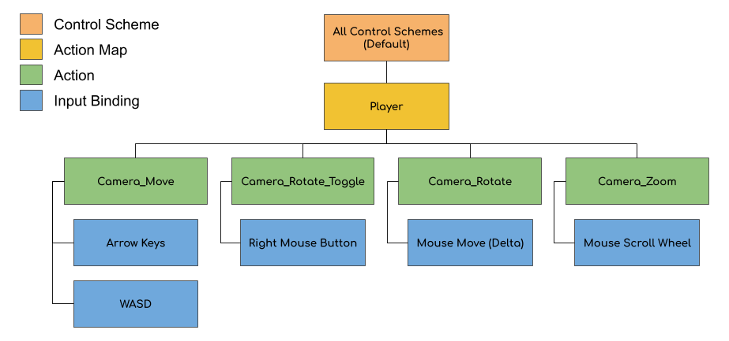
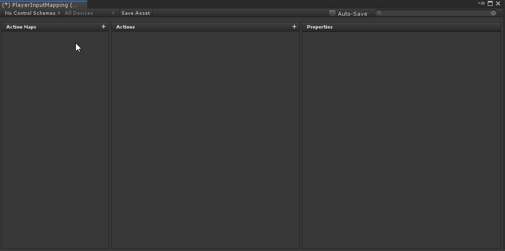
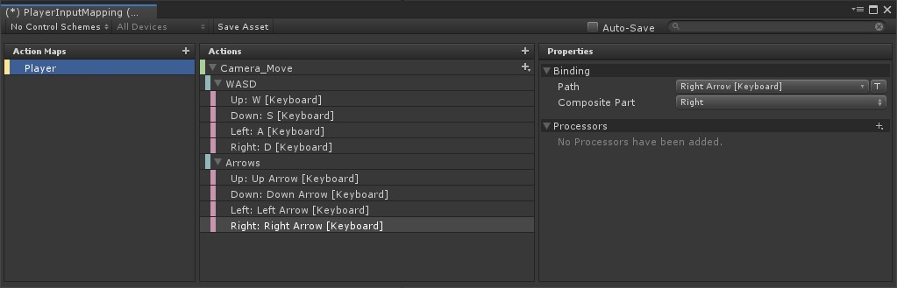
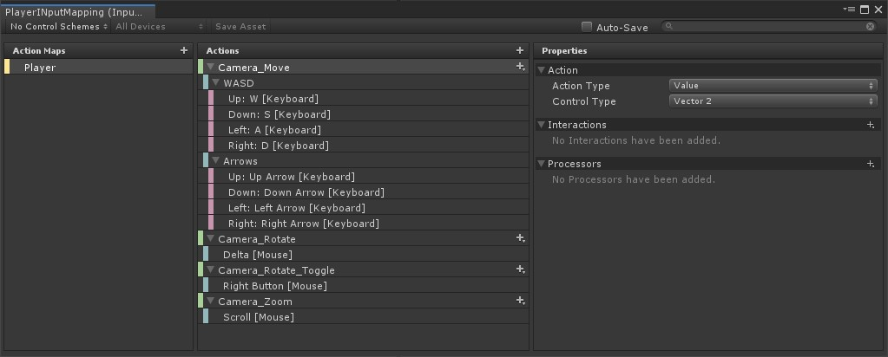

# Setting up the Input System

The new Input System is a lot more complicated than the original one. This makes it harder to learn at first, but for a good cause – it is far more robust and when setup correctly, will take less work to use.

To get started, create an **Input Controls** asset by right clicking in your **Project Hierarchy** and go to:

1. **Create** > **Input Actions**
2. Name the new file **PlayerInputMapping**
3. Double click the file to open the editor window for it

There are four new terms that are important to know when configuring the input: 

1.	**Control Scheme:** A way to specify device requirements that must be met for an input binding to be usable. This is optional and can be left alone (zero requirements). 
2.	**Action Maps:** A collection of actions that can be enabled/disabled in bulk
3.	**Action:** A collection of input bindings that can be grouped under a specific action, such as “Fire” or “Move”.
4.	**Input Bindings:** Specific device input(s) to monitor for, such as a trigger on a gamepad, a mouse button or key on the keyboard. 

> A very common example of an Action to a multiple Input Binding mapping is having a “Fire” action, which might be bound to a trigger for a gamepad and the right mouse button for keyboard/mouse setup.

Action Maps, Actions and Input Bindings each have their own set of properties. We’ll look at these more throughout the tutorial.

## Defining our controls

The input scheme is going to be designed for a keyboard / mouse device but could be easily extended to other inputs as well, if needed. In total, we’ll have one control scheme and action map, four actions and five input bindings. The setup will look like this:

While this may look like a lot, creating the layout is simple. With the **PlayerInputMapping** asset open, create a new Action Map:

1. Click the **+** sign next to **Action Maps** and name it **Player**. This will automatically create an empty Action and Input Binding node. 
2. Rename the **Action** node to **Camera_Move**. Set the following Properties:
      1. **Action Type**: Value
      2. **Control Type**: Vector 2.

We want to use a **2D Vector Composite** binding node instead of the default one that was created. This tells the Input System to send a 2D Vector each time the W, S, A, or D keys are pushed. 

> Don't worry if this doesn't make sense right now. We'll walk through the values that are being sent as we hook up the Actions to our camera.

1.	**Delete** the empty **Binding node** by right clicking on it and selecting **Delete**.
2.	Right click on the **Camera_Move** Action and select **Add 2D Vector Composite**. Name it **WASD**.
3.	Select the node labeled “**Up: <No Binding>**” and set the **Path** to **W [Keyboard]**. 
4.	Repeat this for the remaining nodes (Down, Left, Right), setting them to their respective keys. 

Do the same thing for the Arrow keys. Add another **2D Vector Composite** and name it **Arrows**. Set each mapping to their respective arrow key. Your map should now look like:

Now we just need to setup the remaining actions and bindings:

1.	Add a new **Action** and name it **Camera_Rotate**.
2.	Set the **Action Type** to **Value** and **Control Type** to **Vector 2**.
3.	Click on the **Binding** node and set the **Path** to **Delta (Mouse)**.

Next, we’ll setup the **Camera_Rotate_Toggle** action and binding: 

1.	Add a new **Action** and name it **Camera_Rotate_Toggle**.
2.	Leave the **Action Type** as **Button**. 
3.	Click on the **Binding** node and set the **Path** to **Right Button [Mouse]**.

Lastly, we’ll setup the Camera_Zoom action and binding:

1.	Add a new **Action** and name it **Camera_Zoom**.
2.	Set the **Action Type** to **Value** and **Control Type** to **Vector 2**.
3.	Click on the **Binding** node and set the **Path** to **Scroll [Mouse]**.

Click **Save Asset** to save your changes. Your map should look like this:

### [Previous (Installing the Input System)](./pt-1-installing-the-input-system.md)    |     [Next (Setting up the camera)](./pt-3-setting-up-and-moving-the-camera.md)