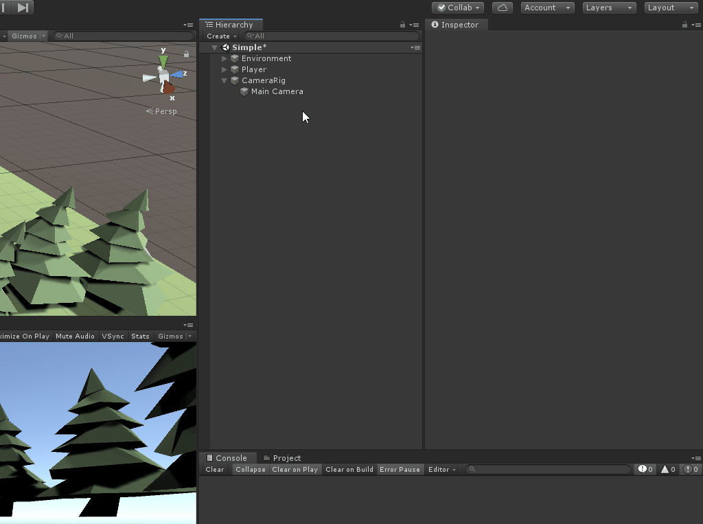

# Hooking it up to our code

Now that there's some initial code, it’s time to do a test run to see how it’s behaving. To do this, you'll need to tell the Input System where to route the actions.

This can be done by adding the Player Input component to a game object in the scene:

1. Create a new game object and call it **GameManager**. game object 
2. Click **Add** **Component** and search for the **Player Input** component
4. Set the following properties:
      1. **Actions**: PlayerInputMapping asset that we just configured
      2. **Default Map**: Player
      3. **Behavior**: Invoke Unity Events
5. Expand the **Events** and **Player** nodes
5. Under the **Camera_Move** event, reference the **CameraRig** game object and set the event to `CameraController.OnMove()`

That’s it! Push play on your game and move the camera around.

> While we will use the “Invoke Unity Events” notification behavior, it is important to understand the different options and how they behave:
> 
> 1. **Send Messages**: This will send input messages to all scripts located on this game object only.
> 2. ***Broadcast Messages**: In addition to sending input messages to components on the same game object, it will also send them down the child hierarchy. *
> 3. ***Invoke Unity Events**: Invokes a UnityEvent for each type of message. The UI can be used to setup callback methods. *
> 4. ***Invoke C Sharp Events**: Similar Invoke Unity Events, but instead are C# events that must be registered via callbacks in your scripts.
> 
> You can read more on the different event types as well as how to set them up [here](https://docs.unity3d.com/Packages/com.unity.inputsystem@1.0/manual/Components.html).

### [Previous (Setting up the camera)](./pt-3-setting-up-and-moving-the-camera.md) | [Next (Fixing the camera movement)](./pt-5-fixing-the-camera-movement.md)