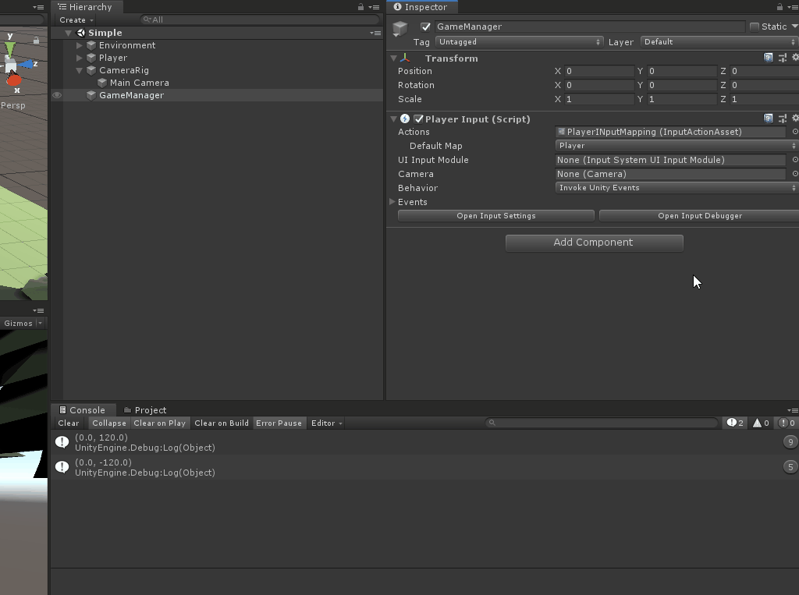

# Adding zoom behavior

Adding the ability to zoom will require a small refactor to keep things clean. This is because the camera will need the ability to recompute its new Y/Z values depending on the current zoom value. 

To start, Add the following global variables and new `UpdateCameraTarget()` method:

```csharp
    //Zoom variables
    private float _currentZoomAmount;
    public float CurrentZoom
    {
        get => _currentZoomAmount;
        private set
        {
            _currentZoomAmount = value;
            UpdateCameraTarget();
        }
    }
    private float _internalZoomSpeed = 4;

    /// <summary>
    /// Calculates a new position based on various properties
    /// </summary>
    private void UpdateCameraTarget()
    {
        _cameraPositionTarget = (Vector3.up * LookOffset) + (Quaternion.AngleAxis(CameraAngle, Vector3.right) * Vector3.back) * _currentZoomAmount;
    }

```

`Start()` can now be updated to set `CurrentZoom` to the `DefaultZoom` value, rather than making the calculation itself, like so:

```csharp
    void Start()
    {
        //Store a reference to the camera rig
        _actualCamera = GetComponentInChildren<Camera>();

        //Set the rotation of the camera based on the CameraAngle property
        _actualCamera.transform.rotation = Quaternion.AngleAxis(CameraAngle, Vector3.right);

        //Set the position of the camera based on the look offset, angle and default zoom properties. This will make sure we're focusing on the right focal point.
        CurrentZoom = DefaultZoom;
        _actualCamera.transform.position = _cameraPositionTarget;
    }
```

Next, add a new `OnZoom()` method and update the `LateUpdate()` method to move the _actualCamera's local position based on the new zoom factor:

```csharp
        /// <summary>
        /// Sets the logic for zooming in and out of the level. Clamped to a min and max value.
        /// </summary>
        /// <param name="context"></param>
        public void OnZoom(InputAction.CallbackContext context)
        {
            if (context.phase != InputActionPhase.Performed)
            {
                return;
            }

            // Adjust the current zoom value based on the direction of the scroll - this is clamped to our zoom min/max. 
            CurrentZoom = Mathf.Clamp(_currentZoomAmount - context.ReadValue<Vector2>().y, ZoomMax, ZoomMin);
        }

    private void LateUpdate()
    {
        //Lerp  the camera to a new move target position
        transform.position = Vector3.Lerp(transform.position, _moveTarget, Time.deltaTime * InternalMoveSpeed);

        //Move the _actualCamera's local position based on the new zoom factor
        _actualCamera.transform.localPosition = Vector3.Lerp(_actualCamera.transform.localPosition, _cameraPositionTarget, Time.deltaTime * _internalZoomSpeed);
    }        
```

Multiple instances of an event are sent with different phases, depending on the input stage. In the case of `OnZoom()`, we only want to process reading the value if we're in the Performed phase as this ensures we aren't getting values that can mess up our logic. Without this check, we would process two more calls for the Started and Canceled phases.

> You can read more about Input Action Phases [here](https://docs.unity3d.com/Packages/com.unity.inputsystem@1.0/api/UnityEngine.InputSystem.InputActionPhase.html).

It's now time to test! Hook up the logic to the Input System the same way as the Move event:

1.	Under the **Camera_Zoom** event, reference the **CameraController** game object and set the event to `CameraController.OnZoom`.
2.	Press play and scroll.

Notice that the zoom is jumping to the min/max zoom value that is set, rather than gracefully incrementing. This is because the input value that is being sent when we scroll is quite large - each scroll yields a vector 2 that is either 0, 120 or 0, -120.

To increment slowly, our logic needs this normalized to 0, 1 or 0, -1. To fix this:

1.	Open the **PlayerInputMapping** asset and select the **Scroll [Mouse]** binding under the **Camera_Zoom** action. 
2.	On the property pane, click the **+** button under the **processors** section and pick **Normalize Vector 2**.
3.	**Save** the file.

> There are several helpful processors that can be applied to the actions, controls and bindings, including specifying dead zone values for gamepad inputs. 
> 
> You can read more on the different event types as well as how to set them up [here](https://docs.unity3d.com/Packages/com.unity.inputsystem@1.0/manual/Processors.html).



That's it! Now you should see smooth scrolling behavior:


### [Previous (Fixing the camera movement)](./pt-5-fixing-the-camera-movement.md) | [Next (Adding rotation behavior)](./pt-7-adding-rotation-behavior.md)
