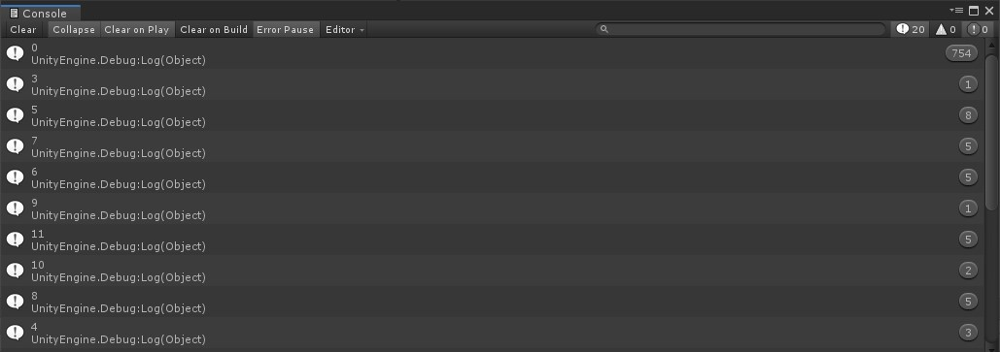

# Adding rotation behavior

Rotating the camera is a two-step process. First, you’ll need to know whether the player is telling you to rotate. This will be done by monitoring whether the Right Mouse button is pushed. If it is then we’ll process the mouse position to tell our game which way to rotate.

Monitoring for a button push is very simple. You just need to read if a float value is 0 (off) or 1 (on). To do this, add the following global variables and `OnRotateToggle()` method to your project:

```csharp
    //Rotation variables
    private bool _rightMouseDown = false;
    private const float InternalRotationSpeed = 4;
    private Quaternion _rotationTarget;
    private Vector2 _mouseDelta;

    /// <summary>
    /// Sets whether the player has the right mouse button down
    /// </summary>
    /// <param name="context"></param>
    public void OnRotateToggle(InputAction.CallbackContext context)
    {
        _rightMouseDown = context.ReadValue<float>() == 1;
    }

```
Add a new `OnRotate()` method to your project to rotate the camera if the right mouse button is pushed:

```csharp
    /// <summary>
    /// Sets the rotation target quaternion if the right mouse button is pushed when the player is moving the mouse
    /// </summary>
    /// <param name="context"></param>
    public void OnRotate(InputAction.CallbackContext context)
    {
        // If the right mouse is down then we'll read the mouse delta value. If it is not, we'll clear it out.
        // Note: Clearing the mouse delta prevents a 'death spin' from occuring if the player flings the mouse really fast in a direction.
        _mouseDelta = _rightMouseDown ? context.ReadValue<Vector2>() : Vector2.zero;

        _rotationTarget *= Quaternion.AngleAxis(_mouseDelta.x * Time.deltaTime * RotationSpeed, Vector3.up);

    }
```

Lastly, add logic to `LateUpdate()` and `Start()` to tell it to rotate the camera:

```csharp

    void Start()
    {
        //Store a reference to the camera rig
        _actualCamera = GetComponentInChildren<Camera>();

        //Set the rotation of the camera based on the CameraAngle property
        _actualCamera.transform.rotation = Quaternion.AngleAxis(CameraAngle, Vector3.right);

        //Set the position of the camera based on the look offset, angle and default zoom properties. This will make sure we're focusing on the right focal point.
        CurrentZoom = DefaultZoom;
        _actualCamera.transform.position = _cameraPositionTarget;

        //Set the initial rotation value
        _rotationTarget = transform.rotation;

    }

    private void LateUpdate()
    {
        //Lerp the camera rig to a new move target position
        transform.position = Vector3.Lerp(transform.position, _moveTarget, Time.deltaTime * InternalMoveSpeed);

        //Move the _actualCamera's local position based on the new zoom factor
        _actualCamera.transform.localPosition = Vector3.Lerp(_actualCamera.transform.localPosition, _cameraPositionTarget, Time.deltaTime * _internalZoomSpeed);

       //Slerp the camera rig's rotation based on the new target
        transform.rotation = Quaternion.Slerp(transform.rotation, _rotationTarget, Time.deltaTime * InternalRotationSpeed);
    }

```

Hook up the logic to the Input System for the new methods:

1.	Under the **Camera_Rotate** event, reference the **CameraController** game object and set the event to `CameraController.OnRotate`.
1.	Under the **Camera_Rotate_Toggle** event, reference the **CameraController** game object and set the event to `CameraController.OnRotateToggle`.
2.	Press play and hold down the right mouse button while you move the mouse around.

While this appears to be working correctly, we're making too many unnecessary calls for updating the rotation. To understand this more, let's take a look as to how many times the `OnRotate()` input event gets called in a single frame. We'll add some temporary code to illustrate this:

```csharp
// Create a new global variable
private float _eventCounter;

// Add the following to the end of OnRotate
// This will increment the eventCounter once per event call
eventCounter += _rightMouseDown ? 1 : 0;

// Add the following to the end of LateUpdate
// As late update runs once per frame, this will log the total number of times the event was called per frame and then clears out the result for the next check
Debug.Log(eventCounter);
eventCounter = 0;

```
When we run this code and rotate the camera, we can see that the `OnRotate()` event is triggered many times per frame:



Additionally, the mouse delta sent with each event trigger in a single frame is accumulating in value. To account for this, it's considered best practice to apply the final delta once per frame.

To fix this, move `_rotationTarget *= Quaternion.AngleAxis(_mouseDelta.x * Time.deltaTime * RotationSpeed, Vector3.up);` from `OnRotate()` and put it in `LateUpdate()`:

```csharp
        private void LateUpdate()
        {
            //Lerp the camera rig to a new move target position
            transform.position = Vector3.Lerp(transform.position, _moveTarget, Time.deltaTime * InternalMoveSpeed);

            //Move the _actualCamera's local position based on the new zoom factor
            _actualCamera.transform.localPosition = Vector3.Lerp(_actualCamera.transform.localPosition, _cameraPositionTarget, Time.deltaTime * _internalZoomSpeed);

            //Set the target rotation based on the mouse delta position and our rotation speed
            _rotationTarget *= Quaternion.AngleAxis(_mouseDelta.x * Time.deltaTime * RotationSpeed, Vector3.up);

            //Slerp the camera rig's rotation based on the new target
            transform.rotation = Quaternion.Slerp(transform.rotation, _rotationTarget, Time.deltaTime * InternalRotationSpeed);

        }

```

That’s it! You should now have a fully functional camera that rotates, zooms and pans around the scene with the new Input System. 

> You can adjust the **RotationSpeed** variable in the inspector to increase the speed, if needed.


### [Previous (Adding zoom behavior)](./pt-6-adding-zoom-behavior.md)
