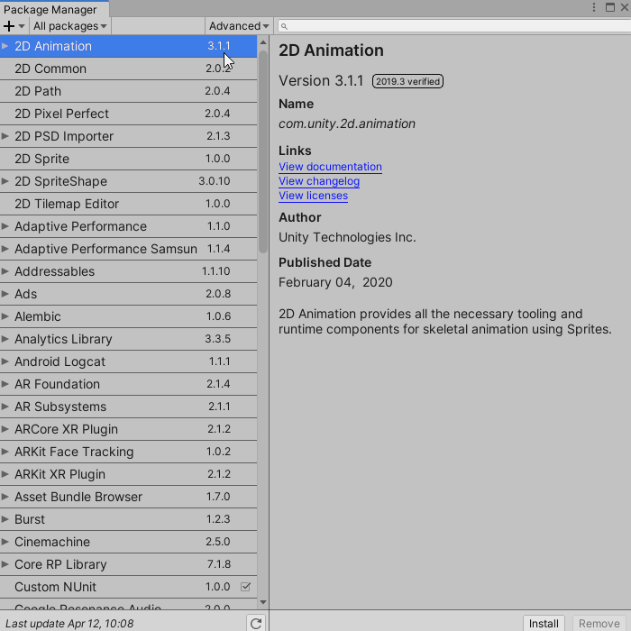
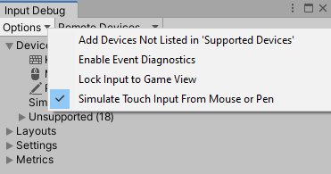

# Getting started

This tutorial relies on scripts and models that are included in the **starter project**. You can download the **starter project** by:

1. Clone and/or download the [GitHub repository](https://github.com/Yecats/GameDevTutorials). 
2. Navigate to the **Implementing-touch-with-the-new-input-system\projects\starterProject** folder in Unity. 

You'll see **Materials**, **Models**, **Prefabs**, **Scenes**, **Scripts** and a **Sprites** folder in **Assets/WUG**. Open the **Demo** scene in **Assets/WUG/Scenes**. 

Before you can start coding, you need to install the Unity Input system.

## Installing the Unity Input System

Multi-platform games are becoming a staple in the gaming industry. The current input system doesn't support anything beyond a simple configuration. To fix this, Unity has been [overhauling the input system](https://blogs.unity3d.com/2019/10/14/introducing-the-new-input-system/) to create a more robust one that better supports multi-platform scenarios. To import it into your project:

1.  Go to **Window** ▸ **Package Manager**.
2.  In the search dialog, type **Input System** to search for the package.
3.  Select the **Input System** package and click **Install**.
4.  If prompted, enable the **backend system**. This requires a restart of Unity.

Some areas of Unity, such as the Universal Render Pipeline, still need the old input system to function. Luckily, you can have both input systems enabled. To tell Unity to use both input systems, do the following:

1.  Go to **Edit** ▸ **Project Settings** ▸ **Player** ▸ **Other Settings**.
2.  Set **Active Input Handling** to **Both**.

## Enabling Touch Simulation Mode

The new Input system lets you simulate touch input from other kinds of devices, such as a mouse or pen. While helpful, this approach has two important limitations:

1.  Simulation results can vary from what you see on the actual device.
2.  You can only simulate a single finger.

Since you'll add pinch logic for zooming, which requires two touchpoints, you can't use simulation mode for this tutorial.

> If you're interested in simulation mode, you can enable it by going to **Window** ▸ **Analysis** ▸ **Input Debugger**. This opens the **Input Debug** window. In this window, select **Options** ▸ **Simulate Touch from Mouse or Pen**. 

Now that you have the system installed, you can gather touch input.

### [Previous (Introduction)](../readme.md)    |     [Next (Get the touch input)](./pt-2-getting-touch-input.md)