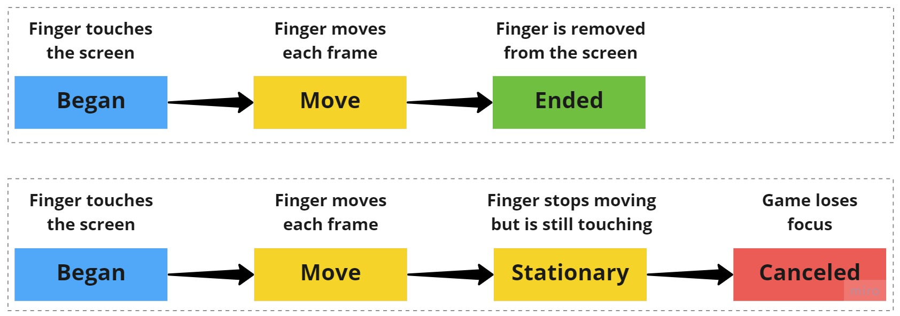

# Getting the touch input

As with anything that gives you deep control, there are several ways gather touch input. Rather than using the [Input Action asset](https://docs.unity3d.com/Packages/com.unity.inputsystem@0.2/manual/index.html) setup, which is great for multiple input device support, you'll use the [EnhancedTouchSupport](https://docs.unity3d.com/Packages/com.unity.inputsystem@1.0/manual/Touch.html) API. This API is useful if you have many touch sources. To start, look at how you can get useful information on the touch actions taken.

1.  Right-click **RW/Scripts**, select **Create** ▸ **C# Script**, and name it **InputManager**.
2.  Select **GameObject** ▸ **Create Empty** from the top menu.
3.  Name the new game object **GameManager**.
4.  Add **InputManager** as a new component to **GameManager**.


Open the script `InputManager` in your favorite code editor. Add these
`using` statements right at the top of the file:

``` csharp
using UnityEngine.InputSystem.EnhancedTouch;
using Touch = UnityEngine.InputSystem.EnhancedTouch.Touch;
```

Then add an `Awake` method to enable Enhanced Touch Support:

``` csharp
private void Awake()
{
    EnhancedTouchSupport.Enable();
}
```

Finally, add the following code to `Update` to start tracking touch actions:

``` csharp
if (Touch.activeFingers.Count == 1)
{
    Touch activeTouch = Touch.activeFingers[0].currentTouch;

    Debug.Log($"Phase: {activeTouch.phase} | Position: {activeTouch.startScreenPosition}");
}
```

Save your changes and return to the Unity editor.

## Touch properties

Before running the project, take a moment to understand the properties available from a **Touch**:

A **finger** is active if it's currently touching the screen. You can access all active fingers by looping through the `Touch.activeFingers` array. Each active finger has a `currentTouch` property. The `currentTouch` property gives you detailed information on the touch action that occurred.

You can filter on the count or index of a finger. By limiting the `count` of activeFingers to one, you ensure `Debug.Log` only executes when one finger touches the screen.

If you have a touchscreen monitor, you can run your project in the editor. Otherwise, build and run to a mobile device. Try touching multiple fingers on the screen and notice no debug logs print in the console for them. 


There are several useful properties associated with each Touch via the `TouchControl` type.

## Phases

Phases give you a high-level understanding of what the input system believes happened. A touch action can have six phases:

1.  **Began**: The initial start of a touch. This only occurs once and triggers when a finger first touches the screen.
2.  **Moved**: The active touch changes position.
3.  **Stationary**: The active touch hasn't moved in a frame.
4.  **Canceled**: The active touch ends in a way other than through user interaction. This happens if focus moves away from the app while a touch is ongoing.
5.  **Ended**: The active touch is completed. This occurs when the finger lifts from the screen. If there are multiple active touches, only the last one will have this phase.
6.  **None**: No activity occurred.

Here's a diagram showing the phases for two common workflows: 



## Position

Three key properties help determine where the finger is currently touching and how much it's moved since the last frame:

1.  **startScreenPosition**: The screen space position where the touch first started.
2.  **delta**: The difference in position since the last frame. You can get a normalized direction as well as the magnitude through sub properties of delta.
3.  **screenPosition**: The current position of the touch. It doesn't match `startScreenPosition` once the touch input registers a movement.

With this in mind, it's time to focus on the camera setup.

### [Previous (Getting started)](./pt-1-getting-started.md)    |     [Next (The camera setup and movement)](./pt-3-moving-the-camera.md)