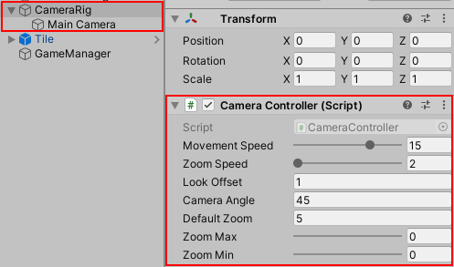

# The camera setup and movement

Building a good camera setup can be quite complicated, depending on the type of game you're creating. In this demo, the camera behaves as it would in an isometric game. There are two ways the player can interact with the camera:

1.  Use a single finger to move around the scene.
2.  Pinch two fingers to zoom in and out.

The project comes equipped with a **camera rig** ready to go. All you need to do is gather input from the player and send it to the `CameraController` script for processing. 



Open up `CameraController` and familiarize yourself with its contents. The key points to know are:

-   **Awake**: Sets the default position, rotation and focal point based on the properties provided.
-   **Update**: Smoothly moves and zooms the camera each frame.
-   **UpdateCameraTarget**: Calculates the new target position and rotation.
-   **Move**: Sets the camera rig's new target position.
-   **Zoom**: Manages the zoom level of the actual camera in increments of half a meter.

## Moving the Camera

The player can only move the camera if a single finger is touching the screen. If that condition passes, then `InputManager` needs to determine if the finger moved to a new location on the screen. If the finger moved, the new position goes to `CameraController.Move`.

**Note**: The **Camera Rig** moves little by little each frame via [Vector3.Lerp](https://docs.unity3d.com/ScriptReference/Vector3.Lerp.html). [Time.DeltaTime](https://docs.unity3d.com/ScriptReference/Time-deltaTime.html) and **MovementSpeed** combine to determine how fast to move the Camera Rig. You can adjust **MovementSpeed** to impact how quickly the camera moves to the new target position.

Open the `InputManager` script and add the following using statement below the existing using statements:

``` csharp
using TouchPhase = UnityEngine.InputSystem.TouchPhase;
```

Next, add a new global variable right above the `Awake` method:

``` csharp
public float touchSpeed = 10f;
```

Then, add a new `MoveCamera` method right below the existing `Update`
method:

``` csharp
private void MoveCamera(Touch touch)
{
    //1
    if (touch.phase != TouchPhase.Moved)
    {
        return;
    }

    //2
    //
    Vector3 newPosition = new Vector3(-touch.delta.normalized.x, 0, 
      -touch.delta.normalized.y) * Time.deltaTime * touchSpeed;

    //3
    CameraController.Instance?.Move(newPosition);
}
```

Here's a step-by-step breakdown:

1.  It ensures remaining logic only executes if the finger is actively moving by checking for `TouchPhase.Moved`. Phases are great for ensuring logic only executes when a specific action is taken.
2.  Then it calculates the new camera position based on the current touch position and desired touch speed.
3.  Finally, it passes the new target position to the camera for calculation.

While the newPosition calculation looks complicated, it's quite simple. It's based on two key values:

1.  **touch.delta.normalized**: A normalized value guarantees the amount is always somewhere between zero and one. This is useful for determining direction without taking the distance measurement into account.
2.  **Time.deltaTime \** TouchSpeed**: Used to calculate the distance the touch input has traveled. Using `Time.deltaTime` and `TouchSpeed` ensures a consistent experience.

Finally, you need to remove the testing logic you added to `Update` earlier. In `Update`, replace all the code inside the `if (Touch.activeFingers.Count == 1)` statement with:

``` csharp
MoveCamera(Touch.activeTouches[0]);
```

Checking that `Touch.activeFingers.Count` is equal to **one** ensures only one finger is on the screen before calling MoveCamera. Save your changes and run or build the game. Then touch the screen to see the camera move. Try adjusting the **Touch Speed** property in the inspector to see how it impacts the movement. 


Now that the player can move the camera, it's time to work on zooming.

### [Previous (Get the touch input)](./pt-2-getting-touch-input.md)    |     [Next (Zoom the camera)](./pt-4-zooming-the-camera.md)