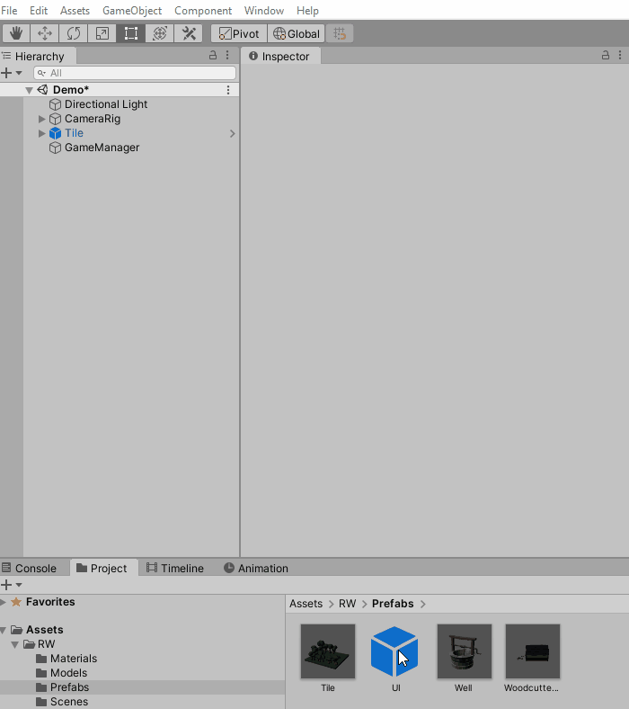
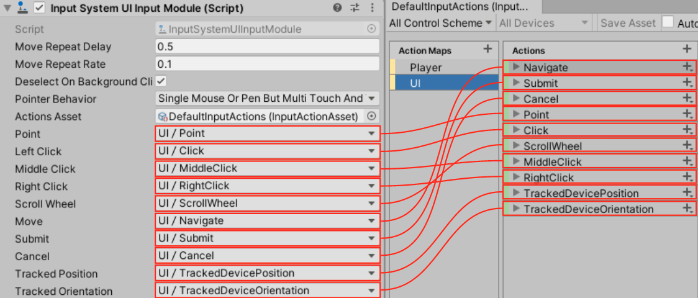

# Set up the UI for building placement 

I've been playing many strategy games lately, which got me thinking: Wouldn't it be fun to give the player the ability to build with the new Input System? So, that's what you're going to do for the final part of this tutorial! Here's how it'll work:

1.  The UI has two icons the player can choose. They can build a woodcutters lodge or a well.
2.  The player taps an icon to instantiate the associated **prefab** in the scene.
3.  Then, they place the **prefab** by dragging their finger to any spot within the **Tile** game object.
4.  If the player removes their finger when it isn't over the **Tile** game object, the prefab is destroyed.

Now, you'll start by setting up the UI.

## Setting up the user interface

The starter project includes a UI prefab with the icons and layout already set up. You only need to add the event logic. First, add the missing game objects to the scene:

1.  Drag the **UI** prefab from **WUG/Prefabs** into the scene.
2.  Then select **GameObject** ▸ **UI** ▸ **Event System** from the top menu.
3.  Next, click the **Replace with InputSystemUIInputModule** button, located on the **EventSystem** ▸ **Standalone Input Module** component.
4.  Finally, change **Pointer Behavior** to **Single Unified Pointer**.

> The **Replace with InputSystemUIInputModule** button only appears if the new Input System package is installed.

Before you go any further, lets take a closer look at the Input System UI Input Module.

## A Deeper look at Input System UI Input Module

**Input System UI Input Module** replaces **Standalone Input Module**, which is how the legacy input system communicates with the UI. Using the new component lets the new Input System communicate with UI events. 

> You can read more about the **Input System UI Input Module** [here](https://docs.unity3d.com/Packages/com.unity.inputsystem@1.0/manual/UISupport.html).

You can configure several properties on the Input System UI Input Module. Here's a quick explanation of each:

-   **Move Repeat Delay**: The initial delay, in seconds, between generating an initial [OnMove](https://docs.unity3d.com/Packages/com.unity.ugui@1.0/api/UnityEngine.EventSystems.IMoveHandler.html) event and repeated events.
-   **Move Repeat Rate**: The interval, in seconds, between generating repeat events when the Move event remains activated.
-   **Deselect on Background Click**: Sets whether the current selection clears when a click happens that doesn't hit any GameObject.
-   **Pointer Behavior**: How to deal with multiple pointers feeding input into the UI.
-   **Actions Asset**: An Input Action Asset containing all the Actions to control the UI. It defaults to a built-in asset.

> Move is a standard UI event. You can read more about UI events [here](https://docs.unity3d.com/Packages/com.unity.ugui@1.0/manual/SupportedEvents.html).

The remaining properties let you map **UI events** to the **input mappings** defined in the **Action Asset**. Here's a look at the default mapping:

## Pointer behavior

**Pointer Behavior** determines how the Input System routes input into the UI if many input devices are available. You can choose from three options:

1.  **All Pointers As Is**: Treats all devices as independent pointers.The type of pointer is transparent to the system. Many pointers can be active at the same time.
2.  **Single Mouse Or Pen But Multi Touch And Track**: Treats any input that isn't Touchscreen or TrackedDevice as a single unified pointer.
    This is the default behavior.
3.  **Single Unified Pointer**: Routes all input from all pointing devices into a single instance.

> Earlier you changed the **Pointer Behavior** property from **Single Mouse Or Pen But Multi Touch And Track** to **Single Unified Pointer**. I tested on a laptop that has both a mouse and a touch screen. With the default value, I found my touches don't register on the UI.

Now that you've learned how the Input System works with the UI, move on to the fun stuff!

### [Previous (Zoom the camera)](./pt-4-zooming-the-camera.md)    |     [Next (Gather the building input)](./pt-6-gather-input-for-building.md)