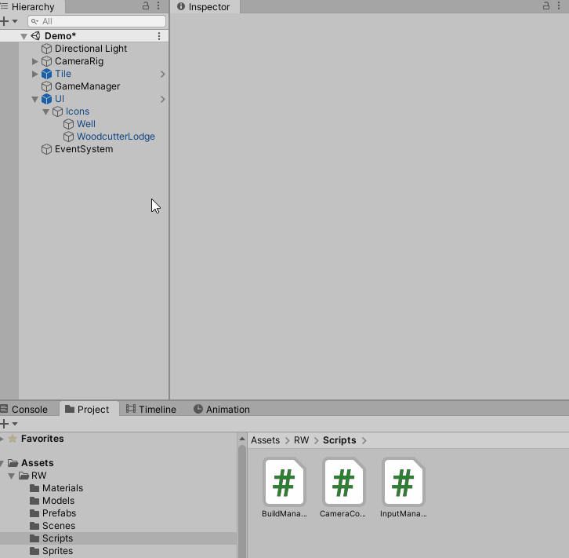
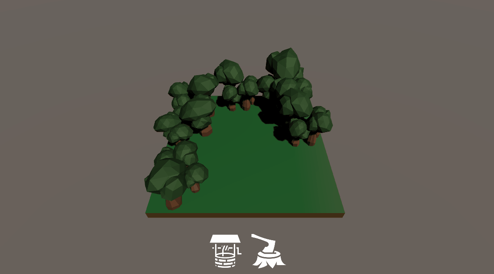

# Finish setting up the user interface

The **Event Trigger** component is wonderful for interacting with all the UI's events. You'll use the **Event Trigger** component to call `BuildManager.Build` during the **PointerDown** event. Here's how to set it up:

1.  Add the `BuildManager` script as a new component to **GameManager**.
2.  In the **Hierarchy** window, go to **UI** ▸ **Icons** ▸ **Well**.
3.  Click **Add Component** and search for **Event Trigger**.
4.  Then click **Add Event Type** and choose **PointerDown**.
5.  Click the **+** button to add a new item to the list.
6.  Set the **GameObject** **reference** to **GameManager**.
7.  Change the **No Function** drop down to **InputManager** ▸ **StartBuildOnPointerDown**.
8.  Set the parameter that appears to the **Well** prefab.
9.  Repeat for the **WoodCutterLodge** game object. Make sure to set the parameter to the **WoodCutterLodge** prefab instead.

That's it for the initial set of build logic. Run the project and try building. You'll notice a sneaky little bug or two. 

### [Previous (Gather the building input)](./pt-6-gather-input-for-building.md)    |     [Next (Fix up the bugs and add some polish)](./pt-8-fixing-bugs-and-adding-polish.md)