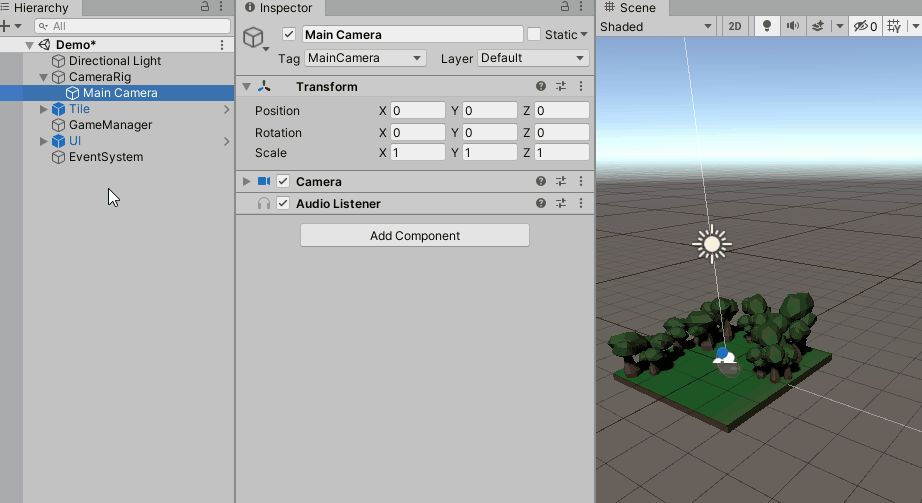

# Fixing the bugs and adding polish

Currently, you have two bugs. The prefab isn't instantiated at the finger and is destroyed when placed on a world tile. These bugs occur because `BuildManager` expects a different scene setup. Look back at `BuildManager.CalculatePosition` and you'll see it has a Raycast looking for two layers. It expects **World**, Layer 9, and **TouchPlacement**, Layer 8. The **Tile** game object is set to **World**, but the scene doesn't have a game object set to **TouchPlacement**. Add it and see how this impacts the behavior:

1.  Right click the **CameraRig** ▸ **Main Camera** and select **3D Object** ▸ **Quad**.
2.  Name the newly created game object **AssetPlacementHelper**.
3.  Set the **position** to **(x: 0, y: 1.8, z: 5)**.
4.  Then set the **rotation** to **(x: 45, y: 0, z: 0)**.
5.  Set the **scale** to **(x: 16, y: 20, z: 1)**.
6.  Next, set the **Layer** to **8: TouchPlacement**.
7.  **Remove** the **Mesh Renderer** component.

**Asset Placement Helper** adds a bit of polish. Without it, and with different `CalculatePosition` logic, the prefab would still follow your finger. In that case it wouldn't follow on a higher Y-axis when not over Tile. That's it! Push play, or build, to see what happens. Everything now works as expected. 

### [Previous (Finish setting up the building UI)](./pt-7-finish-setting-up-the-ui.md)    |     [Next (Challenge: Upgrade a placed building)](./pt-9-challenge-upgrade-a-placed-building.md)