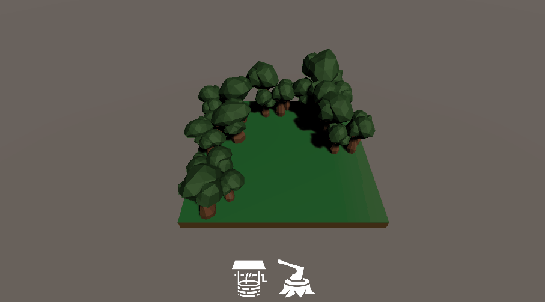

# Implement Touch with the new Input System

> This tutorial was created with Unity version 2019.4.

User input is a core pillar of an interactive and engaging experience. Once you collect it, it's important you present an experience that feels natural and intuitive to the player. In this tutorial, you'll cover the basics of the new **Unity Input System** by creating a demo project that can:

-   Place a 3D model by dragging it off the User Interface (UI) and dropping it into the world.
-   Move the camera by dragging one finger.
-   Zoom the camera by pinching two fingers.

## Learning Outcomes 

You'll learn how to:

-   Install the new Input System's package.
-   Enable Touch Simulation mode.
-   Collect and process touch input via the [EnhancedTouch](https://docs.unity3d.com/Packages/com.unity.inputsystem@1.0/api/UnityEngine.InputSystem.EnhancedTouch.html) API.
-   Route Input System events to the UI.

## Prerequisites

1. This tutorial assumes you already have basic knowledge of Unity and intermediate knowledge of C#. 
2. You need [Unity 2019.4](https://unity3d.com/get-unity/download) or later to follow along with this tutorial. 
3. While you can enable simulation mode for testing, the behavior is unpredictable and only simulates a single touch. As a result, you also need a touch device to complete this tutorial.

## Table of Contents
1. [Getting started](./articles/pt-1-getting-started.md)
2. [Get the touch input](./articles/pt-2-getting-touch-input.md)
3. [Move the camera](./articles/pt-3-moving-the-camera.md)
4. [Zoom the camera](./articles/pt-4-zooming-the-camera.md)
5. [Set up the UI for building placement](./articles/pt-5-setting-up-the-ui-for-building.md)
6. [Gather the building input](./articles/pt-6-gather-input-for-building.md)
7. [Finish setting up the building UI](./articles/pt-7-finish-setting-up-the-ui.md)
8. [Fix up the bugs and add some polish](./articles/pt-8-fixing-bugs-and-adding-polish.md)
9. [Challenge: Upgrade a placed building](./articles/pt-9-challenge-upgrade-a-placed-building.md)

## Resources
1. Comments, concerns and/or questions can be posted [here](https://github.com/Yecats/GameDevTutorials/issues/7).
2. Check out [How to make a configurable camera with the new Unity Input System](https://yecats.github.io/2019/10/17/How-to-make-a-configurable-camera-with-the-new-Input-System.html) if you want to learn more about Action Assets. You'll build the camera rig used in this tutorial from scratch. 
3. You can also check out [Inventory and Store System - Part 3 (Creating the Store UI)](https://channel9.msdn.com/Shows/dotGAME/Inventory-and-Store-System-Part-3-UI) for a deeper look at the UI system. 
4. Input System [documentation](https://docs.unity3d.com/Packages/com.unity.inputsystem@1.0/manual/index.html) and [GitHub repository](https://github.com/Unity-Technologies/InputSystem).
5. The models in this tutorial are from [What Up Games, LLC](http://whatupgames.com/) and the UI icons are from [Game-Icons.net](https://game-icons.net/).
