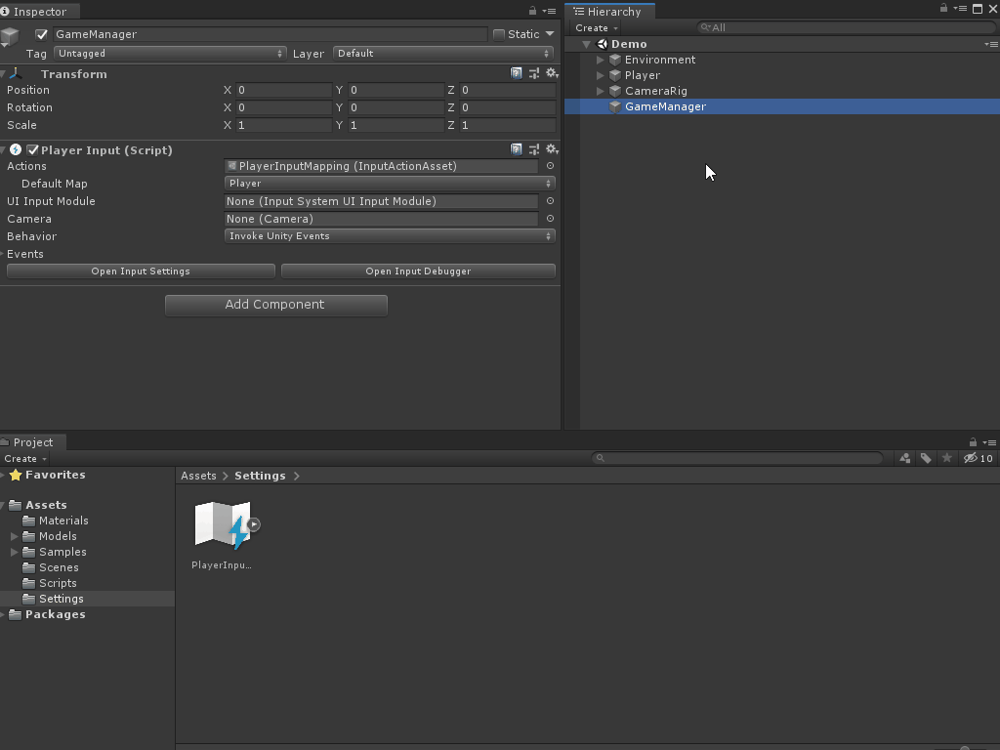

# Refactoring and setting up the project

> **This is a continuation of the [How to make a configurable camera with the new Input System](../../How-to-make-a-configurable-camera-with-the-new-Input-System) tutorial, which covers fundamental knowledge of the Input System. If you have skipped the tutorial but want to follow along, make sure to grab the starterProject files in this repository.**

In the first tutorial, [How to make a configurable camera with the new Input System](../../How-to-make-a-configurable-camera-with-the-new-Input-System), we hooked up interacting with the Input System events via the Player Input component. Since we are going to listen for events via C#, we no longer need that component:

1. Go to the **GameManager** game object and delete the **Player Input** component.

We can take advantage of the Input System's ability to automatically generate C# class based off of our Input Action asset file that we created. This will let us more easily interact with our definition file. To generate the file:

1. Click on the **PlayerInputMapping** asset. 
2. Check the box labeled **Generate C# Class**. 
3. The properties should be:
   1. **C# Class File**: Assets/Settings/PlayerInputMapping.cs
   2. **C# Class Name**: PlayerInputMapping
   3. **C# Class Namespace**: Global Namespace
4. Click **apply**.

This will create a new file at the specified location (Assets/Settings) with the class name of PlayerInputMapping under the global namespace. 

### [Previous (Introduction)](../readme.md)    |     [Next (Listening for Callback Events)](./pt-2-listening-for-callback-events.md)
