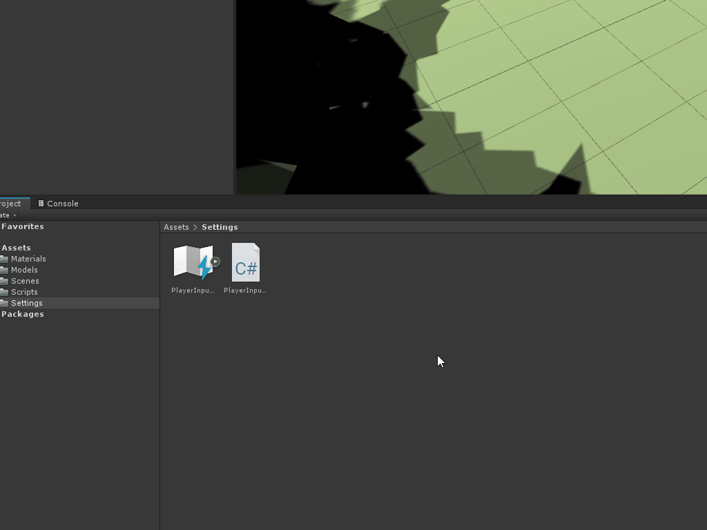

# Setting up the input bindings

The first thing that will need to be done is to give the player a way to tell the game which object(s) they want to select. To enable this, the game will need to monitor for input, which will be tied to the left mouse button.

To start, a new **Action** and **Input Binding** for the **left mouse button** will need to be registered within the **PlayerInputMapping** **Input** **Action** asset: 

1. Open the **PlayerInputMapping** Input Actions file.
2. Create a new **Action** under the **Player** Action Map and name it **Player_Select_Toggle**.
3. Set the **Binding Input** to **Left Button [Mouse]**.
4. Click **Save Asset**.

### [< Previous](../readme.md)    |     [Next >](./pt-2-setting-up-the-scene.md)

