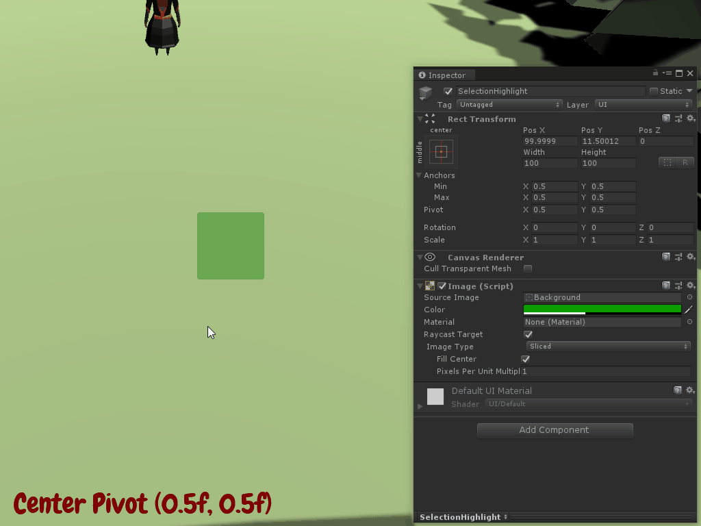

# Setting up the scene
The player will see a green square when they push the left mouse button and drag along the screen. Behind the scenes, a Panel UI object will be used to represent the rectangle they've drawn. The size and position of the box will be determined via mouse properties. 

Setup the scene by adding the canvas and panel:

1. Right click on an empty spot in the hierarchy and go to **UI** > **Canvas**. 
2. Set the following properties:
   1. **Render Mode:** Screen Space Camera
   2. **Render Camera:** Main Camera
   3. **Plane Distance:** 1

By setting the render mode to Screen Space Camera, Unity is being told to 1) place the canvas infront of the specified camera and 2) only render it to that camera. This can allow for greater manipulation in the future, should you want a different experience for a set scenario. The plane distance property is simply saying how far in front of the camera we want the canvas to be.

> You could choose to leave the **render mode** to **Screen Space - Overlay**, if you prefer that method. I find this view more annoying when working in the scene. You can also read more about the Canvas and Render Modes [here](https://docs.unity3d.com/Manual/UICanvas.html).

Next, add the panel that will be used to illustrate where the player is clicking:

1. Right click on the **Canvas** and go to **UI** > **Panel**. 
2. **Name** it **SelectionHighlight**.
3. Set the following properties of the **Rect Transform** component:
   1. **Anchor Preset:** Center
   2. **Width:** 100 (this will be 0 later)
   3. **Height:** 100 (this will be 0 later)
   4. **Pivot:** 0 (x) and 1 (y)
4. Set the following property of the **Image** component:
   1. **Color Hexadecimal**: 0D9F00

The anchor preset is specifying where on the canvas the panel should be positioned if the canvas were to be altered in size. For our purposes, this is irrelevant as we will be manipulating the position via code. We just do not want it to stretch across the entire canvas, which is what it was set to do by default. The width and height are also two elements that will be set via code. These are set to 100 for now for testing purposes but will be set to zero once all of the functionality is working. 

The pivot is very important as it has a direct impact to how the panel is drawn and moved. For example, the default, which is `.5, .5`, specifies a pivot point of **center** for the panel. With this setup, any time the panel is moved or resized, it'll be from the center point of the panel. What we want is to draw and move on the top left corner of the panel. Setting a pivot point of `0, 1` will set the proper positioning.

> Rotation, size and position are drawn around the pivot point. You can read more about anchor presets and pivot points [here](https://docs.unity3d.com/Manual/UIBasicLayout.html).

### [< Previous](./pt-1-setting-up-the-input-bindings.md)    |     [Next >](./pt-3-moving-the-panel-based-on-mouse-click.md)
