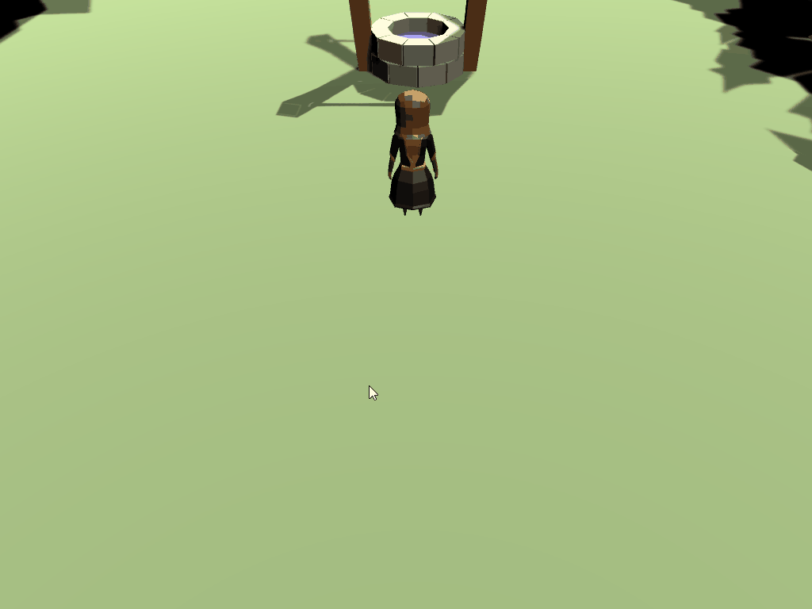

# Moving the panel based on mouse click

The logic for managing selected game objects and performing the correct action when the input is triggered will be done in a new script, called `PartyManager.cs`. Create the script and add the following code:

```csharp
[Header("General Properties")]

[SerializeField] 
private RectTransform _selectedPanel;
[SerializeField]
private RectTransform _canvas;
[SerializeField]
private Camera _camera;

//mouse position variables
private Vector2 _mouseStartPosition;
private bool _leftMouseButtonDown;

void Start()
{
    //We should provide these values in the inspector, but just in case we'll traverse the hiarchy to find them
    if (_canvas == null)
    {
        _canvas = FindObjectOfType<Canvas>().GetComponent<RectTransform>();
    }

    if (_selectedPanel == null)
    {
        //This call is safe since we only have a single child - if you grow your UI beyond one child, this will need to be changed.
        _selectedPanel = _canvas.GetComponentInChildren<RectTransform>();
    }

    if (_camera == null)
    {
        _camera = Camera.main;
    }
}

public void LeftMouseDown_OnClick(InputAction.CallbackContext context)
{
    //record if we are pressed
    _leftMouseButtonDown = context.phase == InputActionPhase.Performed;

    // store the mouse start position
    _mouseStartPosition = Mouse.current.position.ReadValue();
        
    //Takes a screen point and transforms it to local point within a Rect Transform (in this case, the canvas)
    Vector2 mousePos;
    RectTransformUtility.ScreenPointToLocalPointInRectangle(_canvas, _mouseStartPosition, _camera_, out mousePos);

    //move the select panels start position to the initial mouse click position
    _selectedPanel.localPosition = mousePos;
}
```

The logic within `Start()` is pretty straight forward - it's just checking to make sure we have a reference to the needed objects and if not, searches the hierarchy for them. Things get a little more interesting with `LeftMouseDown_OnClick()`, particularly with the `RectTransformUtility.ScreenPointToLocalPointInRectangle()` method call. In order for the mouse position to register properly on the UI, it needs to be converted to a local point within the Canvas' screen space. This helper method is a provided by Unity and will do the conversion for us. 

> There are three types of coordinate systems within Unity:
> 
> 1. **World Space (Global Coordinates)**: The raw coordinate of an object within to the game world. 
> 2. **Local Space (Local Coordinates)**: The coordinate of an object relative to it's parent. 
> 3. **Screen Space**: Two dimensional space that represents the absolute pixels of a screen. 
>
> Converting between these spaces is a very common action that will be done many times throughout a game.

The `LeftMouseDown_OnClick()` method will need to be hooked up to the Input System before testing can begin. Open the `InputManager` script and add the following lines to the end of `Awake()`:

```csharp
    _input.Player.Player_Select_Toggle.performed += PartyManager.LeftMouseDown_OnClick;
    _input.Player.Player_Select_Toggle.canceled += PartyManager.LeftMouseDown_OnClick;
```

Add the `PartyManager` script to the **GameManager** game object:

1. Click on **GameManager** within the hierarchy of the screen and go to **Add Component** > **Party Manager**.
2. Within the inspector window, add references to the **Selected Panel**, **Canvas** and **Camera** objects.

> Reminder: By hooking to the **performed** and **canceled** events only, the `LeftMouseDown_OnClick()` method will never get a call from the **started** event.

Save the scripts and test the logic in the scene. The panel should move to where the mouse position is when the left mouse button is pushed down initially:



### [< Previous](./pt-2-setting-up-the-scene.md)    |     [Next >](./pt-4-scaling-the-panel-based-on-mouse-position.md)
