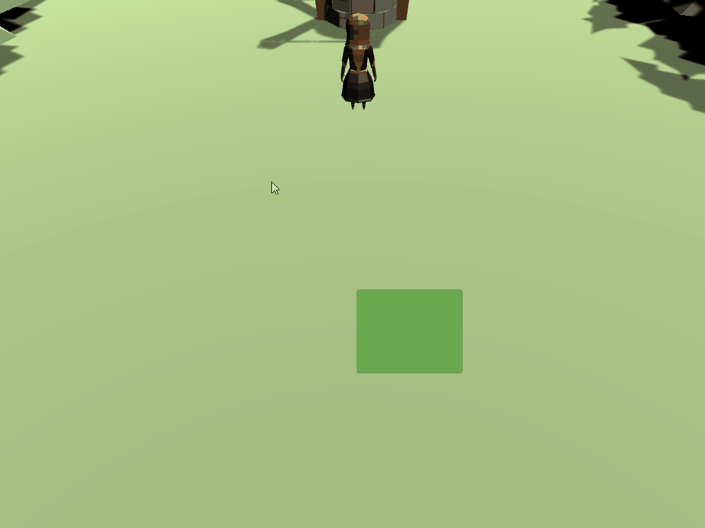
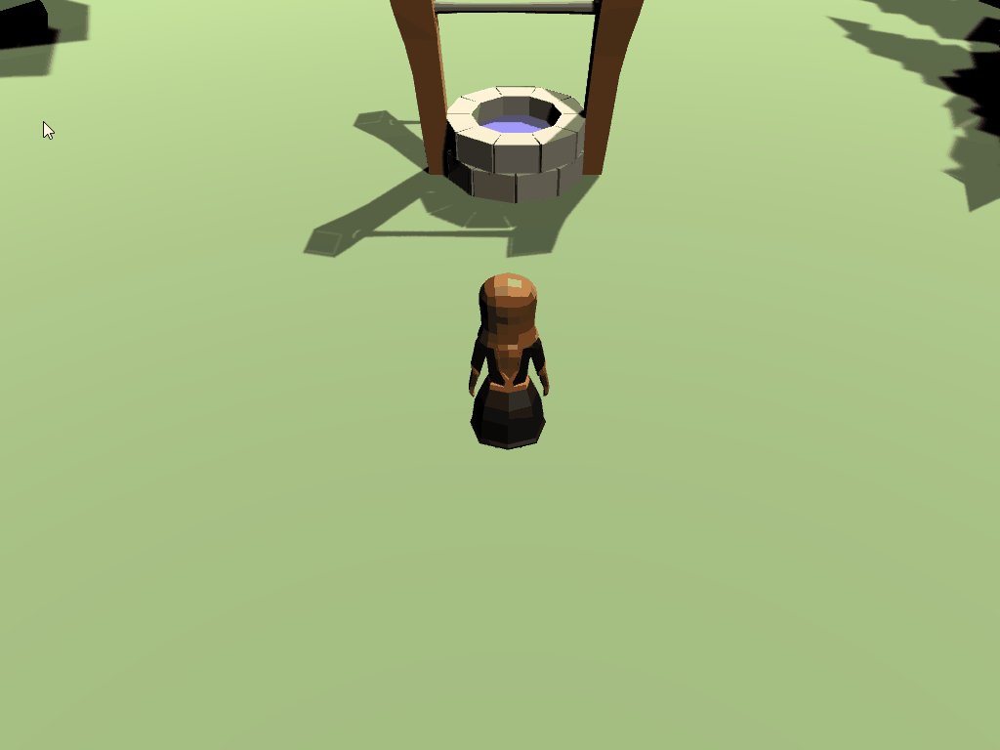

# Scaling the panel based on mouse position

While that's neat, the player should be able to draw a rectangle that indicates the space in the world that they want to select objects in. Fortunately, this is simple to do! 

In `PartyManager.cs`, add the following methods:

```csharp
/// <summary>
/// Draws the select UI visual on the screen
/// </summary>
private void DrawSelectWindow()
{
    //get a vector2 based on the difference of where the mouse started and where it's at now
    _bounds = _mouseStartPosition - Mouse.current.position.ReadValue();

    //set the width of the panel based on the delta between start and end position (abs ensures it's always positive)
    _selectedPanel.sizeDelta = new Vector2(Mathf.Abs(_bounds.x), Mathf.Abs(_bounds.y));

}

void FixedUpdate()
{
    //we're only taking action if the left mouse button is currently down
    if (!_leftMouseButtonDown)
    {
        return;
    }

    DrawSelectWindow();
}
```

While this sort of works, there are three problems that need to be fixed:

1. The select panel always moves to the mouse position, rather than only when the button is initially pushed.
2. The select panel should disapear from the screen when the left mouse button is not pushed.
3. The player can't go up or to the left when creating a selection box.



### Fixing the panel movement
To fix the panel movement (and keep the logic clean), the `LeftMouseDown_OnClick()` method should stop from running if the **input phase** is **canceled**. 

Add the following `if` statement to the `LeftMouseDown_OnClick()` method:

```csharp
public void LeftMouseDown_OnClick(InputAction.CallbackContext context)
{
    //record if we are pressed
    _leftMouseButtonDown = context.phase == InputActionPhase.Performed;

    // stop executing if phase is canceled
    if (context.phase == InputActionPhase.Canceled)
    {
        return;
    }
    
    // store the mouse start position
    _mouseStartPosition = Mouse.current.position.ReadValue();
    ...
}
```

The problem that this still presents is that when the mouse button is no longer down, the select panel is still on the screen. A good UX would have it disappear. To get this, zero out the width/height for the `_selectedPanel` by adjusting the if statement so that it looks like the following:  

```csharp
// stop executing if phase is canceled & zero out the height / width
if (context.phase == InputActionPhase.Canceled)
{
    _selectedPanel.sizeDelta = Vector2.zero;
    return;
}
```

### Fixing the selection logic
To fix the selection logic, the panels scale will need to be flipped depending on where the mouse position is at. This will let us draw the panel backwards. Add the following code to the end of `DrawSelectWindow()`:

```csharp
// Set the scale of the rect based on direction the mouse has been moved. This will flip it if we are going backwards
float xDirection = _bounds.x < 0 ? 1 : -1;
float yDirection = _bounds.y < 0 ? -1 : 1;

//Set the local scale of the visual panel
_selectedPanel.localScale = new Vector3(xDirection, yDirection, 1);
```

### Adding the final touches
That's all the logic that we need for drawing the selection panel. The last thing to do is set the initial height/width to be 0, rather than 100. This will make sure the player doesn't see the panel when the game is first run. To do this:

1. Select the **SelectionHighlight** game object in your hierarchy.
2. Set the following properties of the **Rect Transform** component:
   1. **Width:** 0
   2. **Height:** 0



### [< Previous](./pt-3-moving-the-panel-based-on-mouse-click.md)    |     [Next >](./pt-5-setup-the-scene-for-selecting-objects.md)