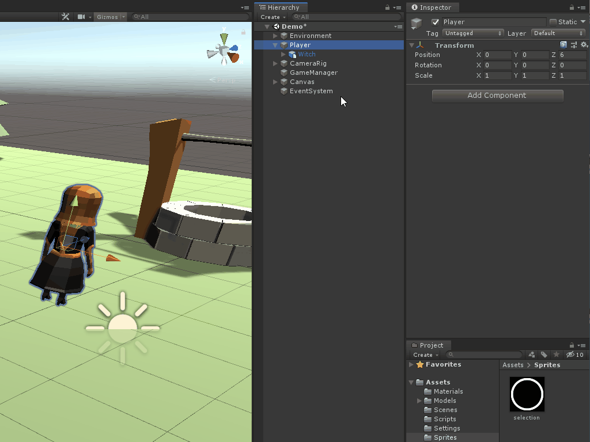
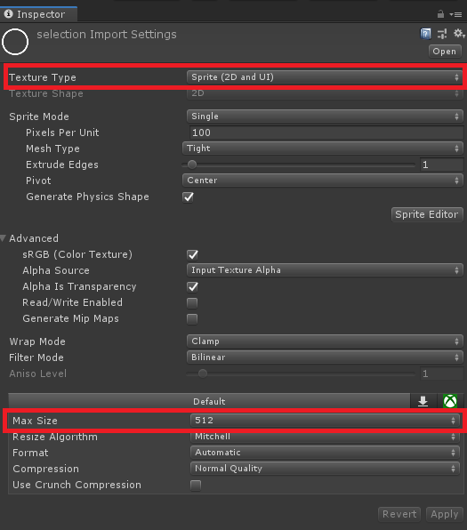
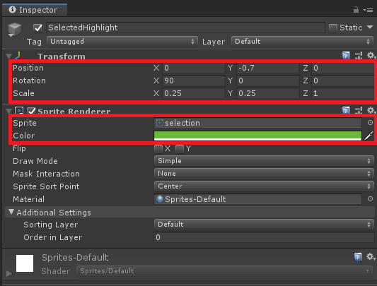

# Setup the scene for selecting objects
> This logic would work with any point within the game object. In other words, a collider is not required. You could instead have it set to the Transform.positin property of a game object or even your own arbitrary point. 

The `collider.bounds.center` property will be used to determine the center point of the selectable game object. If the player drags their selection box over said center point, then the objects property will become selected. If it's not over the center point, it'll be unselected. 

> The bounds of a collider is the bounding volume in world space. It has useful properties, such as:
> 
> 1. **Center**: The center point of the bounding box as a Vector3.  
> 2. **Min**: The minimal point of the box as a Vector3.
> 3. **Max**: The maximum point of the box as a Vector3.
> 4. **Extents**: The total distance between the center point and the edge of the box.
> 5. **Size**: The total size of the box as a Vector3.

Before setting up the scene, a new script will need to be created to do three key things: 

1. Add itself to a collection of Player objects, which we'll iterate through when determining if any are being selected.
2. Track whether the player is currently selected.
3. Toggle the visual to indicate its selected state.

Create a new script called `PlayerDetails`. Add the following logic:

```csharp
public class PlayerDetail : MonoBehaviour
{
    [Header("General Properties")]
    public Collider MyCollider;
    public GameObject SelectedHighlight;

    private bool _isSelected;
    public bool IsSelected
    {
        get => _isSelected;
        set
        {
            //toggle whether the character is selected
            _isSelected = value;
            //toggle the sprite object based on selected state
            SelectedHighlight.SetActive(_isSelected);
        }
    }

    void Awake()
    {
        //get a reference to the collider if not set via the inspector
        if (MyCollider == null)
        {
            MyCollider = GetComponentInChildren<Collider>();
        }
        //Get a reference to the sprite if not set via the inspector
        if (SelectedHighlight == null)
        {
            SelectedHighlight = GetComponentInChildren<SpriteRenderer>(true).gameObject;
        }
    }

    void Start()
    {
        //Add itself to the list of Characters which will be iterated through when detecting selection
        PartyManager.Characters.Add(this);
    }

}
```
Once again, `Awake()` is being used to make sure that the script has the references needed. `Start()`'s job is to add the PlayerDetails script to a static list (which will be created next). The `IsSelected` property is doing the last two remaining tasks - it is toggling a bool value that represents the selected state and will toggle a visual sprite in the scene.

Next, create a new global variable that is a static List of `PlayerDetails` to the `PartyManager` script and instantiate it in `Awake()`:

```csharp
public static List<PlayerDetail> Characters;

void Awake()
{
    Characters = new List<PlayerDetail>();
}
```

> Having a static list makes it unnecessary to follow the singleton pattern or get a reference to the script for each character. This is a personal preference as the other two methods would work just fine. 

It is now time to setup the **Player** game object:

1. Within the hierarchy, click on the **Witch** child object of **Player** and go to **Add Component** > **Capsule Collider**.
2. Set the following properties:
   1. **Center**: 0, 0, -0.2
   2. **Height:** 2



To setup the highlight game object:

1. Download the highlight sprite from [here]( https://github.com/Yecats/GameDevTutorials/tree/master/tutorials/Unity/Select-multiple-objects-based-on-center-of-collider/assets) and import it into Unity.
2. Click on the imported file and set the following properties:
   1. **Texture Type:** Sprite (2D and UI)
   2. **Max Size:** 512
4. Click **Apply**.



5. Right click on the **Player** in the hierarchy and go to **2D Object** > **Sprite**. 
6. Name the new game object **SelectedHighlight**.
7. On the **Transform** component, set the following properties:
   1. **Position:** 0, -0.7, 0
   2. **Rotation:** 90, 0, 0
   3. **Scale:** 0.25, 0.25, 1
8. Within the **Sprite Render Component**, set the following properties:
   1. **Sprite:** Selection.png
   2. **Color:** 6BBA36
9. **Disable** the game object. 

> I made the witch several years ago when I was first learning to model and it appears she was exported incorrectly, so some of her properties are a bit off at times. I have not had a chance to make another player object yet. Sorry about that!



Add the `PlayerDetail` script to the **Player** game object in the scene:

1. Click on the **Player** in the hierarchy and go to **Add Component** > **PlayerDetail**.
2. Assign the **Witch** child object to the **My Collider** property.
3. Assign the **SelectedHighlight** game object to the Selected Highlight property.

To make the test more interesting, add a couple more of the characters to the scene: 

1. **Duplicate** the **Player** game object at least two times and move each one to a new position in the scene. 


### [< Previous](./pt-4-scaling-the-panel-based-on-mouse-position.md)    |     [Next >](./pt-6-coding-the-selection-logic.md)
