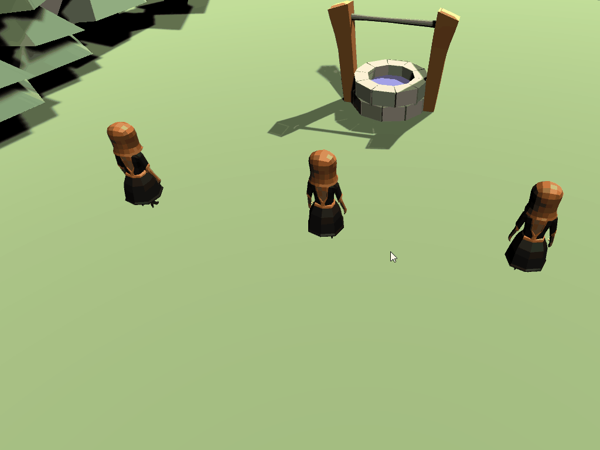

# Coding the selection logic
The world space point of the `collider.bounds.center` property will need to be converted in the UI space to detect if a character should be selected. Then it will be compared to the bounds of the **Selection Panel** to see if it exists within it. If it does, then `PlayerDetail` will be notified to turn set the `isSelected` property to true.

Two new methods will need to be created to handle this logic: 

1. **WorldToUiSpace**: This is a helper method. It will take a world space and convert it to a point on the UI. 
1. **SelectPartyMembers**: This will loop through all of the registered characters in our List and use `WorldToUiSpace()` to determine if they are within the bounds of the `_selectedPanel` object.

Within the `PartyManager` script, add the new methods and update `FixedUpdate()` to call `SelectedPartyMembers()`:

```csharp
/// <summary>
/// Toggles party member selection on/off based on the selection rectangle that was drawn by the player
/// </summary>
private void SelectPartyMembers()
{
    //Loop through all registered characters
    foreach (PlayerDetail character in Characters)
    {
        //Get a point on the UI that represents the equivalent for the collider's center point
        Vector2 screenPosition = WorldToUiSpace(character.MyCollider.bounds.center);

        //Check to see if that point is within the bounds of the selection panel 
        character.IsSelected = RectTransformUtility.RectangleContainsScreenPoint(_selectedPanel, screenPosition);
    }
}

/// <summary>
/// Reads a point in world space and converts it to a world space equivalent on the UI
/// </summary>
/// <param name="worldPoint">Returns a UI position on the provided transform from a world position vector</param>
private Vector2 WorldToUiSpace(Vector3 worldPoint)
{
    //Convert the world point of the collider center to Screen Point
    Vector2 screenPoint = _camera.WorldToScreenPoint(worldPoint);

    //Convert the screen point to UI rectangle local point
    Vector2 uiPosition;
    RectTransformUtility.ScreenPointToLocalPointInRectangle(_canvas, screenPoint, _camera, out uiPosition);

    //Convert the screen point from local to world coordinate
    return _canvas.TransformPoint(uiPosition);
}

void FixedUpdate()
{
    //we're only taking action if the left mouse button is currently down
    if (!_leftMouseButtonDown)
    {
        return;
    }

    DrawSelectWindow();
    SelectPartyMembers();
}
```
That's it! Push play and see our selection working.



### [< Previous](./pt-5-setup-the-scene-for-selecting-objects.md)    |     [Next >](./pt-7-challenge-extending-the-selection-logic.md)
