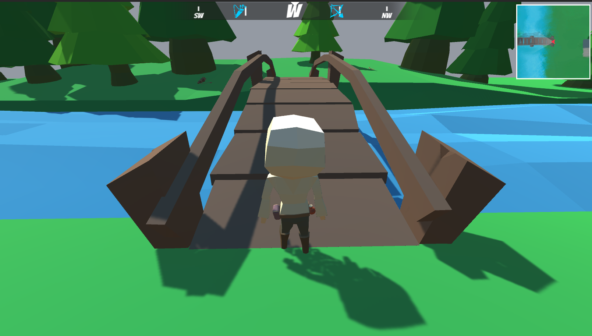

> ## View the entire tutorial on [GameDev Resources](https://gamedev-resources.com/create-a-map-system-with-ui-toolkit/).

# Introduction
Maps are important for many games as they help guide the player towards key initiatives and if done right, help engross them further into the world. There are two types of maps - full map and a mini map. This tutorial will walk through how to implement both using UI Toolkit. 

## Learning Outcomes
This tutorial will cover advanced scenarios of UI Toolkit and how you can create a full and mini map. By the end, you will learn:

* A practical workflow for building a reusable map that can be displayed in full or mini mode.
* Basic masking in UI Toolkit.
* Advanced stylesheet techniques using complex selectors.
* Animating style properties in C# with UI Toolkit’s experimental animation features.

## Prerequisites
* You should have Unity 2021.2 or later to follow along with this tutorial.
* This tutorial assumes you have basic knowledge of Unity and UI Toolkit.