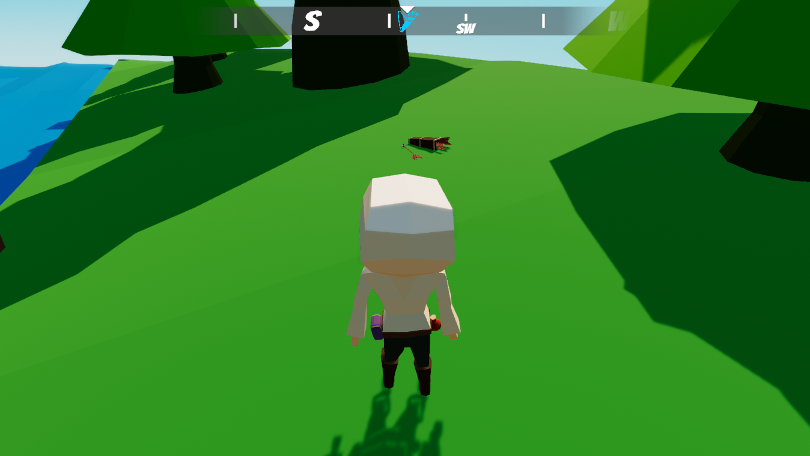

> ## View the entire tutorial on [GameDev Resources](https://gamedev-resources.com/create-a-compass-with-ugui/).
> 
# Introduction

Keeping players engaged in your game can be a challenging task. For some games, guiding the player towards key objectives is incredibly important and can make or break engagement. A popular approach is to provide a compass that has icons overlay the direction that they should move. In this tutorial, you will create a general compass that has an overlay of gathering objectives for the player to complete. When the player reaches an objective, a UnityEvent is raised which will equip the new equipment and destroy the 'dummy' world objective.

## Learning Outcomes
In this part of the series, you will learn how to:

* Work with uGUI components, such as canvas, image, and masking.
* Rotate a repeating texture based on the user input.
* Create a prefab.
* Use UnityEvent to call a custom method to handle when an objective is completed.

## Prerequisites

> Tutorials may work with earlier versions. The version referenced is the one I used.

* You should have Unity 2020.3 LTS or later to follow along with this tutorial.
* This tutorial assumes you have basic knowledge of Unity.

## Resources

* [SoftMaskForUGUI](https://github.com/mob-sakai/SoftMaskForUGUI)
* [Icons from Game-Icons](https://game-icons.net/)
