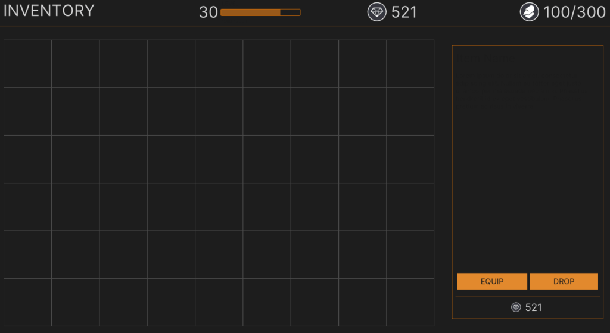

> ## View the entire tutorial on [GameDev Resources](https://gamedev-resources.com/create-a-spatial-inventory-with-ui-toolkit-part-1/).
> 
# Introduction

Inventory systems are a great way to help facilitate how you want the player to engage in your game. Perhaps one of the most important components to consider are the constraints you want the system to help enforce. For example, many games gate what a player can carry based on the total weight of all the items. A slightly less common way is based on the item size. This has been done by games such as Resident Evil 4 and Dues Ex. In addition to controlling how much a player can carry, it also creates a mini game out of the inventory by requiring them to strategically organize to maximize what they can carry.

This tutorial is part of a series which will explore how you can create an inventory that requires the player to sort by item size. Part 1 will walk through creating the UI design below.

## Learning Outcomes
In this part of the series, you will learn how to:

* A practical workflow for building up a complex UI with different zones.
* The basics of using UI Toolkit & UI Builder.
* How to create and work with a stylesheet.
* How to add the UI to a scene

## Prerequisites

> Tutorials may work with earlier versions. The version referenced is the one I used.

* You should have Unity 2021.1.12f1 or later to follow along with this tutorial.
* This tutorial assumes you have basic knowledge of Unity.

## Resources

1. [Clean Vector Icons by PONETI](https://assetstore.unity.com/packages/2d/gui/icons/clean-vector-icons-132084)
