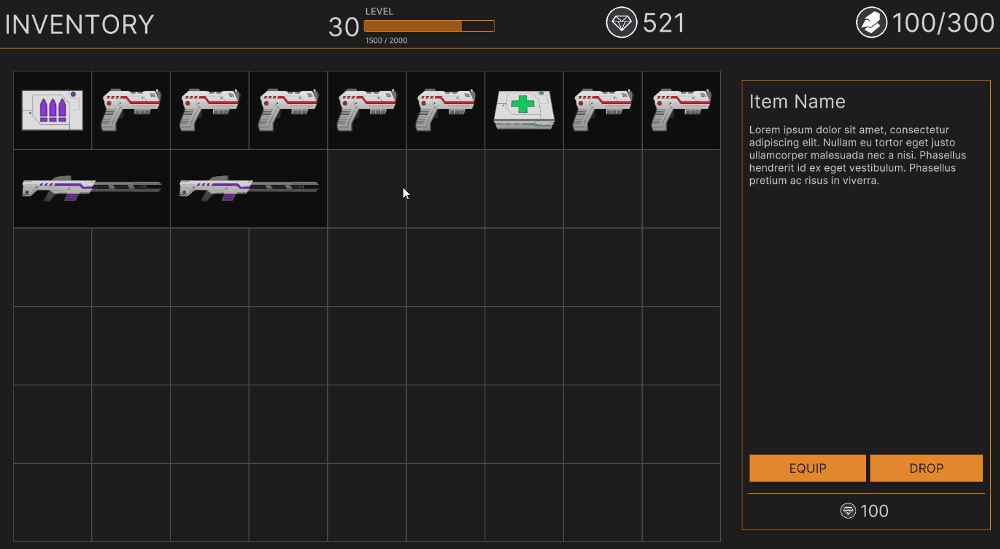

> ## View the entire tutorial on [GameDev Resources](https://gamedev-resources.com/code-the-grid-based-inventory-system-grid-series-part-2/).
> 
# Introduction

There are many different styles of inventory systems and in this tutorial series you will learn how to create a grid-based system that requires the player to sort items by size to carry as many as possible. This part of the series builds on the design from part 1 by instantiating a visual to represent items held and adding the ability to organize them. On the surface, this logic seems simple – just drag/drop. However, scenarios that prevent an item from being placed make the logic more complicated.

> This tutorial is a continuation of the grid inventory system that was started in Part 1, [Design the Grid Based Inventory System](https://gamedev-resources.com/create-a-spatial-inventory-with-ui-toolkit-part-1/).

## Learning Outcomes
This tutorial will cover the basics of interacting with UI Toolkit from C# and populating it with data from a ScriptableObject. By the end, you will know how to:

* Define and create scriptable object assets to represent items in an inventory
* Create a Visual Element and set various properties via C#
* Hook up mouse/pointer click and move events to implement drag/drop behavior
* Check for overlapping Visual Elements
* Set a Visual Elements position at runtime based on the mouse

## Prerequisites

* You should have Unity 2021.1.12f1 or later to follow along with this tutorial.
* This tutorial assumes you have basic knowledge of Unity and C#.

> This tutorial will work with earlier versions of Unity but has a higher chance of having UI Toolkit related bugs and may have different installation requirements. Check out the UI Builder release notes for more information on compatible versions.

